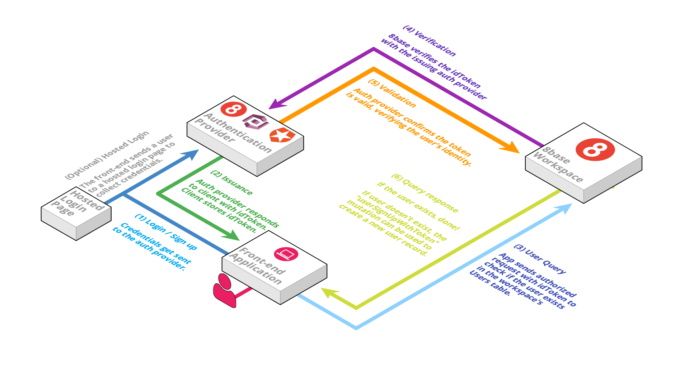
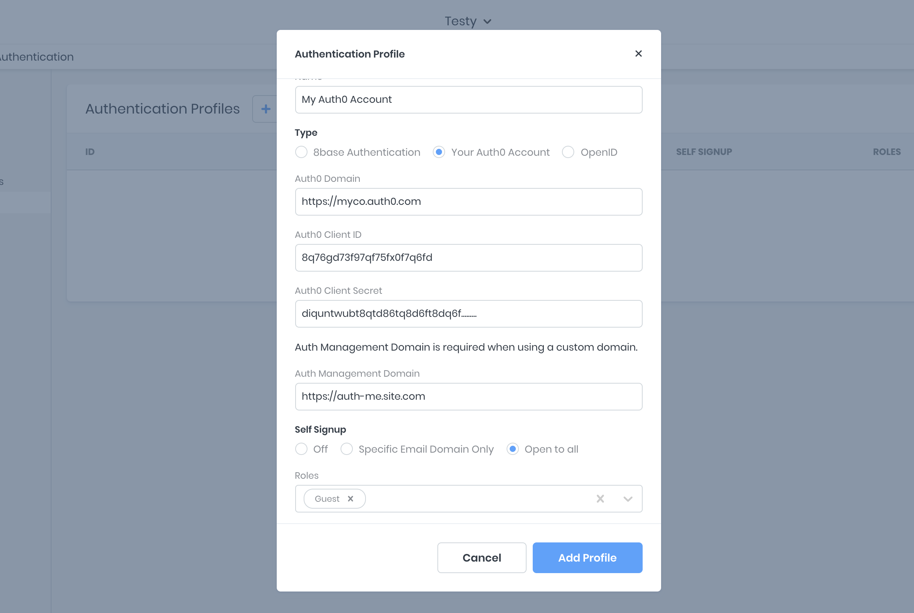
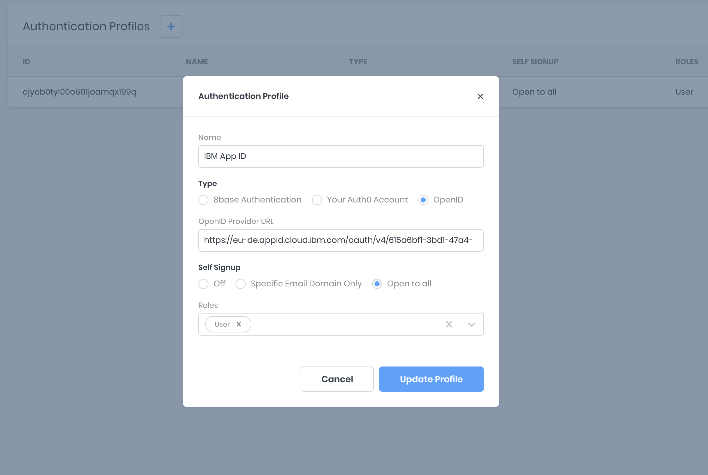
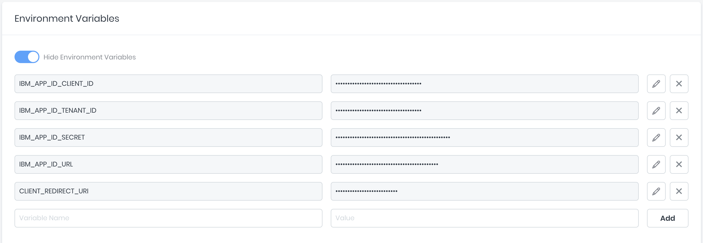
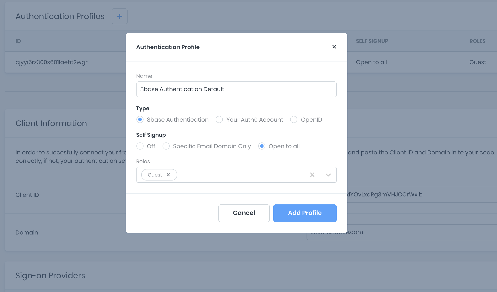
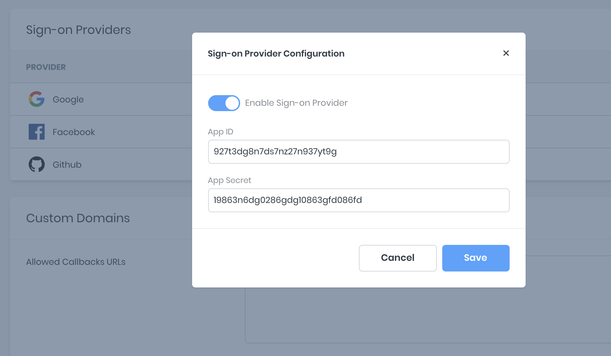

# Authentication

Every 8base workspace initializes with native support for signing up, managing, and authorizing your application's Users. This feature eliminates the requirement of managing emails and passwords or social sign-on providers without compromising on access to your user data.

## Understanding Authentication



While 8base simplifies the process of setting up authentication, it's important to still have a basic understanding of what's going on under the hood! Using the diagram above, we can get a clear picture of how the authentication flow works.

### 1. Login / Signup
It's important to understand that 8base does **not** store or manage passwords. All login credentials get stored with an auth provider, which means that only an auth provider can login or register a user! Therefore, 8base allows you to use GraphQL Mutations or a *Hosted Login Page* to send a user's credentials to auth providers, However, it's the auth provider's system that will validate a user's credentials and identity.

### 2. Issuance
When an auth provider authenticates a user, it issues an `idToken`. Think of the `idToken` as a temporary passport that contains information about the user that authenticated. This `idToken` get's returned to the front-end application. It can be stored and used to authenticate API requests made to and 8base workspace. 

*To dive deeper into idTokens (JSON Web Tokens), please visit [https://jwt.io/](https://jwt.io/)*

### 3. User Query
**Simply authenticating a user doesn't add them to a workspace's *Users* table in 8base**. However, using the `idToken`, an authenticated request can be sent to the workspace API and check whether the token's user exists. To authenticate that request, the token only needs to be added as a *Bearer* token in the authorization header.

For example, if you're using Javascript `fetch` to handle the request, your script might look something like the following.

```javascript
fetch('8BASE_WORKSPACE_API_ENDPOINT', {
  method: 'POST',
  headers: { 
    'Content-Type': 'application/json', 
    'Authorization': `Bearer ${idToken}`
  },
  body: JSON.stringify({ query: '{ user { id } }' }),
})
  .then(userExistsCallback)
  .catch(userDoesntExistCallback)
```

### 4. Verification
When 8base recieves an authorized API request (a request containing an `idToken`) it validates that token with the issuing auth provider. 8base handles this step using data that's encoded in the `idToken`. This way, a fraudulent token is detected and discarded before any sensitive data is accessed.

### 5. Validation
Once the auth provider validates that the `idToken` – and the user claiming the token – are authentic, it let's 8base know. 8base now can confidently extract the user's primary identifier from the token (for example, email address) and query an existing record in the *Users* table.

### 6. Query Response
If the query runs succesfully and a user record is returned, great! Just ensure to continue sending the `idToken` in the authorization header on future API calls.

If the query **fails and a user record is not found**, we simply need to create a record for the new user. This can be accomplished using the [`userSignUpWithToken`](#mutation-usersignupwithtoken), as seen below.

```javascript
mutation {
  userSignUpWithToken(
    authProfileId: "8BASE_AUTHENTICATION_PROFILE_ID"
    user: {
      email: "my@email.co"
	    // ...any other user data
    }
  ) {
    id
  }
}
```

## Authentication Types
Under the hood, 8base utilizes [Auth0](https://auth0.com/) to manage your users' identities and ensure the best security standards. All user accounts are by default stored in an Auth0 account that's managed by 8base. For upgraded workspace plans, the option of connecting one's Auth0 account or an OpenID provider is available.

### 8base Authentication


To create an *Authentication Profile*, navigate to the `Settings > Authentication` and press the `+` button. The form that appears can be completed using the following fields described.

* **Name**: A name that describes what this profile does. In this sample case, you can replace My Auth in the screenshot above with a name like Guest User Auth.

* **Type**: Select 8base authentication

* **Self Signup**: Open allows users to self-register. Otherwise, you can restrict access to only invited users or users within a specific domain (i.e., '@company.com').

* **Roles**: Roles can be either Guest, Administrator, or any custom role. Multiple-roles can be selected.

#### Client information
An authentication profile's corresponding client-side information is generated once created. Client-side information allows for connecting client applications to the 8base back-end and any corresponding authentication settings. Client ID and Domain are not sensitive strings and are added to one or more client apps.

#### Configure Callback URLs
A callback URL is an endpoint that is invoked after a user authenticates. Users are not able to log into an application and receive an error if this field is left empty. By default, the callback URL `http://localhost:3000/auth/callback` is set. Keep it, or replace it with an existing URL from your application.

#### Configure Logout URLs
The logout URL is where a user is sent after logging out. Specify them in the Allowed Logout URLs field. The default logout URL is http://localhost:3000/ and attempting to log out when no logout URL was provided displays an error.

### Your Own Auth0 Account
There are only a few steps required to set up your Auth0 account on 8base. First, navigate to the `Settings > Authentication` of your workspace and create a new *Authentication Profile*. In the form that appears, select *Your Auth0 Account*.

All required information is in the settings of your Auth0 account.



### OpenID Connect
The ability to set up an authentication provider that supports the OpenID specification is available for workspaces on a *Professional* or *Enterprise* plan. Some light setup required in the Management Console and a custom *resolver* function needs to be deployed to your project's workspace to use this feature.

#### Configuring the OpenID Settings
In the 8base Management Console, you're able to configure one or more authentication providers under `Settings > Authentication`. Click the "+" button and fill out the provider form, selecting *OpenID* as the type and adding an OpenID Provider URL. Once completed, the record is saved to your *Authentication Profiles*.



#### getToken Resolver
A custom *getToken* resolver mutation function must be deployed to the workspace. This can be done by installing the [8base CLI](../development-tools/cli/README.md).

In the provided *getToken* function, the relevant environment variables are accessed - if set in the Management Console - to provide the required credentials and configurations. A request is then made to the authentication provider to query or create the authenticating user from the database and return the user's token.



```yaml
functions:
  getToken:
    handler:
      code: src/getToken.ts
    type: resolver
    schema: src/getToken.graphql
```



```javascript
const { URLSearchParams } = require('url');
const fetch = require('node-fetch');
const gql = require('graphql-tag');
const jwtDecode = require('jwt-decode');

const APP_ID_CLIENT_ID = process.env.APP_ID_CLIENT_ID;
const APP_ID_TENANT_ID = process.env.APP_ID_TENANT_ID;
const APP_ID_SECRET = process.env.APP_ID_SECRET;
const APP_ID_URL = process.env.APP_ID_URL;
const TOKEN_PATH = '/token';

const CLIENT_REDIRECT_URI = process.env.CLIENT_REDIRECT_URI;

const CURRENT_USER_QUERY = gql`
  query CurrentUser {
    user {
      id
      email
    }
  }
`;

const USER_SIGN_UP_MUTATION = gql`
  mutation UserSignUp($user: UserCreateInput!, $authProfileId: ID) {
    userSignUpWithToken(user: $user, authProfileId: $authProfileId) {
      id
      email
    }
  }
`;

export default async (event: any, context: any) => {
  const body = new URLSearchParams();

  body.append('grant_type', 'authorization_code');
  body.append('code', event.data.code);
  body.append('client_id', APP_ID_CLIENT_ID);
  body.append('redirect_uri', CLIENT_REDIRECT_URI);

  let token;
  let email;

  try {
    let tokenResponse = await fetch(`${APP_ID_URL}${APP_ID_TENANT_ID}/${TOKEN_PATH}`, {
      body,
      headers: {
        'Authorization': 'Basic ' + Buffer.from(`${APP_ID_CLIENT_ID}:${APP_ID_SECRET}`).toString('base64'),
        'Content-Type': 'application/x-www-form-urlencoded'
        'Accept': 'application/json',
      },
      method: 'post',
    });

    ({ id_token: token } = await tokenResponse.json());

    try  {
      await context.api.gqlRequest(CURRENT_USER_QUERY, {}, {
        authorization: token,
      });
    } catch (e) {
      ({ email } = jwtDecode(token));

      await context.api.gqlRequest(USER_SIGN_UP_MUTATION, {
        user: {
          email,
        },
        authProfileId: event.data.authProfileId,
      }, {
        authorization: token,
      });
    }
  } catch (e) {
    console.log(e);
    throw Error('Authorization Error');
  }

  return {
    data: {
      token,
    },
  };
};
```



```javascript
type TokenResult {
  token: String!
}

extend type Mutation {
  getToken(code: String!, authProfileId: ID!): TokenResult
}

```



#### Setting Environment Variables
To set environment variables that can be accessed from within custom functions, open up your workspace, and navigate to `Settings > Environment Variables`. Here, any key-value pair may be securely stored and accessed from within your functions at `process.env.<ENV_VARIABLE_KEYNAME>`.



### Sign-on Providers
Sign-on providers can easily be enabled/disabled in the *8base Authentication Settings* section of the workspace's Authentication view. At least one authentication profile with the type set to "8base Authentication" is required to use this feature.



Each sign-on provider requires a *Client ID* and *Client Secret*. These credentials are collected from the sign-on provider(s) you want to configure. Once collected, enter the credentials into the relevant sign-on provider form before clicking "Enable Sign-On Provider" and "Save."



## GraphQL API Auth Operations
The [GraphQL API](./graphql-api/README.md) has a number of auth related operations that can be used when using hosted auth pages or building a *custom authentication flow*.

### Mutation.userLogin
For users that sign up using email/password, the `userLogin` mutation can be used to authenticate a user and retrieve an `idToken` and `refreshToken`. This operation can **NOT** be used when an existing `idToken` is specified in the request's authorization header.

```javascript
// Mutation.userLogin(data: UserLoginInput!)
mutation {
  userLogin(data: {
    email: "my@email.com"
    password: "myP@$$word"
    authProfileId: "SOME_PROFILE_ID"
  }) {
    success
    auth {
      idToken
      refreshToken
    }
  }
}
```

### Mutation.userSignUpWithPassword
A user can be signed up by using the `userSignUpWithPassword` mutation. This operation can **NOT** be used if an existing `idToken` is specified in the request's authorization header.

```javascript
// Mutation.userSignUpWithPassword(authProfileId: ID, password: String!, user: UserCreateInput!)
mutation {
  userSignUpWithPassword(
    authProfileId: "SOME_PROFILE_ID"
    password: "myp@$$word"
    user: {
      email: "my@email.co"
			// other user data
    }
  ) {
    id
    email
  }
}
```

### Mutation.userSignUpWithToken
Once an `idToken` has been obtained from an auth provider, the user can get registered in a workspace using the `userSignUpWithToken` mutation. This operation **requires** that an `idToken` is specified in the request's authorization header.

```javascript
// Mutation.userSignUpWithToken(authProfileId: ID, user: UserCreateInput!)
mutation {
  userSignUpWithToken(
    authProfileId: "SOME_PROFILE_ID"
    user: {
      email: "my@email.co"
			// other user data
    }
  ) {
    id
    email
  }
}
```

### Mutation.userRefreshToken
After an `idToken` has been issued, there is a 72-hour window during which the `refreshToken` is valid. Everytime the refresh token is used, it resets and generates a new `idToken` and `refreshToken`. 

```javascript
// Mutation.userRefreshToken(data: RefreshTokenInput!)
mutation {
  userRefreshToken(data: {
    email: "my@email.co"
    refreshToken: "SOME_REFRESH_TOKEN"
    authProfileId: "SOME_PROFILE_ID"
  }) {
    idToken
    refreshToken
  }
}
```

## Troubleshooting
If you're unable to get the authentication provider to work and are receiving a "Not Authorized" error message, you may need to update the associated role and its API permissions. You can do this by first ensuring that the configured provider has an associated role, like *Guest*. Next, navigate to `Settings > Roles > [ROLE_NAME] > Data` and ensure that the role is enabled for the *Get Token* function call.