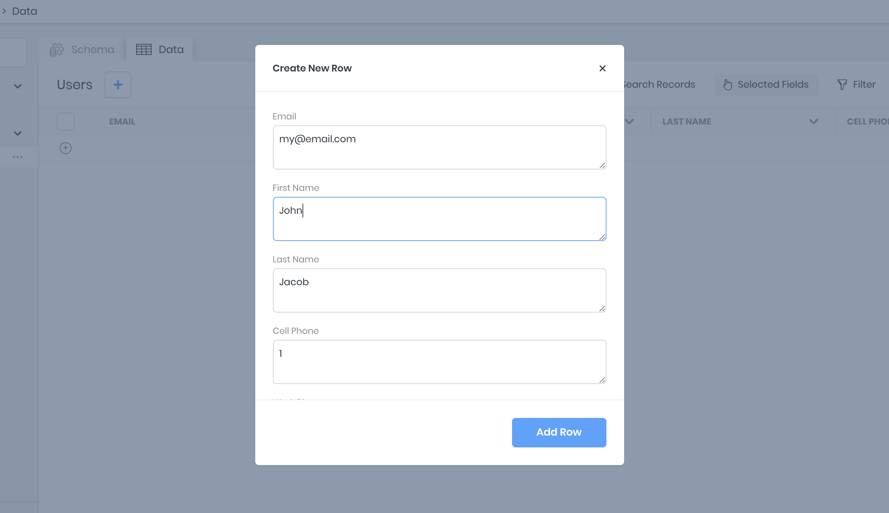

# Users + Authentication

Every 8base workspace is initialized with native support for signing up, managing and authorizing your application's Users. This eliminates the requirment of managing emails and passwords or social sign-on providers without compromising on access to your user data.

## Users

### User Table
**Users** is defined as a *System Table* in 8base, meaning that it required in every workspace. That said it is fully customizable using the Data Builder and can be configured as required by your application.

By default, the User table has the following fields defined.

```javascript
{
	id: ID
	_description: String
	createdAt: DateTime
	updatedAt: DateTime
	createdBy: User
	email: String
	is8base: Boolean
	firstName: String
	lastName: String
	cellPhone: String
	workPhone: String
	workPhoneExt: String
	gender: String
	birthday: String
	language: String
	timezone: String
	avatar: File
	sentInvitations: Array
	permissions: Array
	roles: Array
}
````

### Managing Users in the Console
In most applications, Users records will be creates as a part of a sign-up flow. However, in situations where a User must be created, updated or deleted manually by an admin it is easy to do so using the Data Viewer pane when reviewing the Users' table.



## Authorization
Under the hood, 8base utilizies [Auth0](https://auth0.com/) to manage your users' identities and ensure the best security standards are being met. All user accounts are by default stored in an Auth0 account that's managed by 8base. For upgraded workspace plans, the option of connecting ones own Auth0 account or an OpenID provider is available.

### Your Own Auth0 Account
To set up your own Auth0 account on 8base, there are only a few steps required. First, navigate to the `Settings > Authentication` of your workspace and create a new *Authentication Profile*. In the form that appears, select *Your Auth0 Account*. 

All required information can be found in the settings of your Auth0 account.


### OpenID Connect
The ability to setup an authentication provider that supports the OpenID specification is available for workspaces on a *Profession* or *Enterprise* plan. To use this feature, there is some light setup required in the Managment Console and a custom *resolver* function that should be deployed to your project's workspace.

### Social Sign-on Providers
In progress...

##### Configuring the OpenID Settings
In the 8base Management Console you're able to configure one or more authentication providers under `Settings > Authentication`. Click the "+" button and fill out the provider form, selecting *OpenID* as the type and adding a OpenID Provider URL. Once completed, the record will be saved to your *Authentication Profiles*.


##### getToken Resolver
A custom *getToken* reslover mutation function should be deployed to the workspace. This can be done by installing the [8base CLI with instruction at the provided link](../development-tools/cli/README.md).

In the *getToken* function provided, the relevant environment variables are being accessed - as they are set in the Management Console - to provide the required credentials and configurations. A request is then made to the authentication provider, the authenticating user queried from the database - or created when not found - and token returned.



```yaml
functions:
  getToken:
    handler:
      code: src/getToken.ts
    type: resolver
    schema: src/getToken.graphql
```



```javascript
const { URLSearchParams } = require('url');
const fetch = require('node-fetch');
const gql = require('graphql-tag');
const jwtDecode = require('jwt-decode');

const APP_ID_CLIENT_ID = process.env.APP_ID_CLIENT_ID;
const APP_ID_TENANT_ID = process.env.APP_ID_TENANT_ID;
const APP_ID_SECRET = process.env.APP_ID_SECRET;
const APP_ID_URL = process.env.APP_ID_URL;
const TOKEN_PATH = '/token';

const CLIENT_REDIRECT_URI = process.env.CLIENT_REDIRECT_URI;

const CURRENT_USER_QUERY = gql`
  query CurrentUser {
    user {
      id
      email
    }
  }
`;

const USER_SIGN_UP_MUTATION = gql`
  mutation UserSignUp($user: UserCreateInput!, $authProfileId: ID) {
    userSignUpWithToken(user: $user, authProfileId: $authProfileId) {
      id
      email
    }
  }
`;

export default async (event: any, context: any) => {
  const body = new URLSearchParams();

  body.append('grant_type', 'authorization_code');
  body.append('code', event.data.code);
  body.append('client_id', APP_ID_CLIENT_ID);
  body.append('redirect_uri', CLIENT_REDIRECT_URI);

  let token;
  let email;

  try {
    let tokenResponse = await fetch(`${APP_ID_URL}${APP_ID_TENANT_ID}/${TOKEN_PATH}`, {
      body,
      headers: {
        'Authorization': 'Basic ' + Buffer.from(`${APP_ID_CLIENT_ID}:${APP_ID_SECRET}`).toString('base64'),
        'Content-Type': 'application/x-www-form-urlencoded'
        'Accept': 'application/json',
      },
      method: 'post',
    });

    ({ id_token: token } = await tokenResponse.json());

    try  {
      await context.api.gqlRequest(CURRENT_USER_QUERY, {}, {
        authorization: token,
      }); 
    } catch (e) {
      ({ email } = jwtDecode(token));

      await context.api.gqlRequest(USER_SIGN_UP_MUTATION, {
        user: {
          email,
        },
        authProfileId: event.data.authProfileId,
      }, {
        authorization: token,
      });
    }
  } catch (e) {
    console.log(e);
    throw Error('Authorization Error');
  }

  return {
    data: {
      token,
    },
  };
};
```



```javascript
type TokenResult {
  token: String!
}

extend type Mutation {
  getToken(code: String!, authProfileId: ID!): TokenResult
}

```



##### Setting Environment Variables
To set environment variables that can be accessed from within custom functions, open up your workspace and navigate to `Settings > Environment Variables`. Here, any key-value pair may be securely stored and accessed from within your functions at `process.env.<ENV_VARIABLE_KEYNAME>`.


##### Troubleshooting
If you're unable to get the authentication provider to work and are recieveing a "Not Authorized" error message, you may need to update the associated role and it's API permissions. You can do this by first ensuring that the configured provider has an associated role, like *Guest*. Next, navigate to `Settings > Roles > [ROLE_NAME] > Data` and ensure that the role is enabled for the *Get Token* function call.