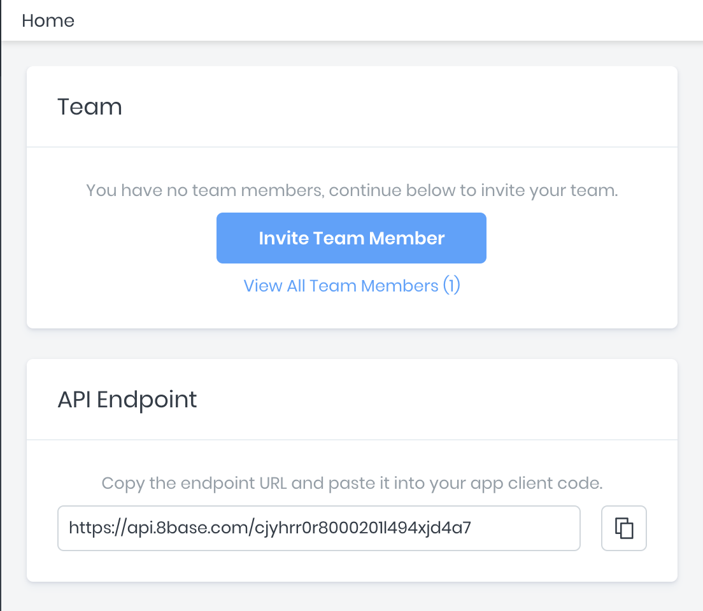

# GraphQL API

All workspaces in 8base are assigned unique API endpoints. These endpoints handle GraphQL queries, mutations and subscriptions for every data table (covering all Create, Read, Update, Delete operations, plus some...) out-of-the-box.


All API Endpoints are structured as so:
`https://api.8base.com/<WORKSPACE_ID>`


The API comes pre-configured with filtering, pagination, full-text search and many other advanced features, putting the best tools possible for accessing data in the front-end developer's hands.

*Note: Using [Custom Functions](../custom-functions/README.md), these GraphQL resources can be extended and added to in any way seen fit.*

There are several way of retrieving an API endpoint for your workspace. The easiest is to login to the [8base Management Console](https://app.8base.com), select a workspace and copy the `API Endpoint` displayed on the dashboard.

