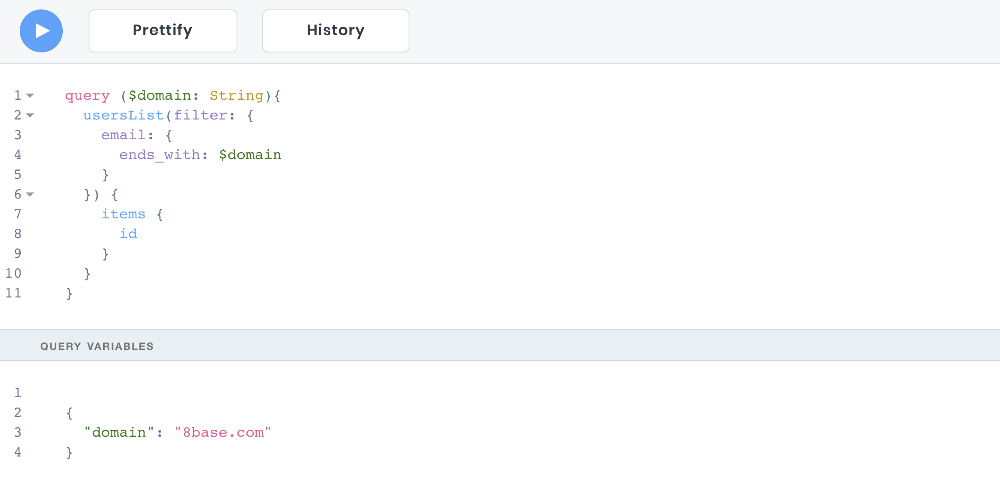

# Variables Definitions

To avoid hardcoding all values when working with GraphQL, the **API Explorer** provides a *Variables* section in which a JSON object can be added. The top level keys of the JSON object are made available as variables that have names denoted by a dollar-sign ($KEY_NAME). This allows for a much more enjoyable development experience when writing and testing dynamic queries, mutations, and subscriptions.



### Declaring Variables

Some dynamic inputs might need to be added when you submit a request to your GraphQL server, while keeping the operation document remains the same. These are your operation's variables. Variables must be typed arguments that get declared on the GraphQL operation. Because GraphQL is typed statically, whether you're passing in the correct variables can be validated for you.

The following two examples would work together for querying a list of female users over the age of 45.

##### JSON Variable
```json
{
	"age": 45,
	"gender": "female"
}
```

##### Query
```js
query ($gender: String, $age: Int) {
	usersList(filter: {
    gender: {
      equals: $gender
    },
    age: {
    	gt: $age
    }

  }) {
    items {
    	id
      name
    }
  }
}
```

You can see that the keys here match the variable names specified in the variables definition. These variable names denoted with the *$* are what get used in the selecton set.

### Declaring Typed Variables
Variables are not limited to being single input values. They can be complex objects with any declared *type* in a given workspace—native or custom. This allows for things like entire filters, sorts, and many others to get passed dynamically as variables. 

The following two examples would work together for querying a list of *Posts* in "draft" status that belong to the *Author*, which is the logged in user—supplying the filter as a variable.

##### JSON Variable
```json
{  
   "filter":{  
      "author":{  
         "OR":[  
            {  
               "posts":{  
                  "none":{  
                     "status":{  
                        "equals":"draft"
                     }
                  }
               }
            }
            {  
               "AND":[  
                  {  
                     "user":{  
                        "id":{  
                           "equals":"__loggedInUserId"
                        }
                     }
                  }
               ]
            }
         ]
      }
   }
}
```

##### Query
```js
query ($filter: postFilter) {
	postsList(filter: $filter) {
    items {
    	id
      name
    }
  }
}
```