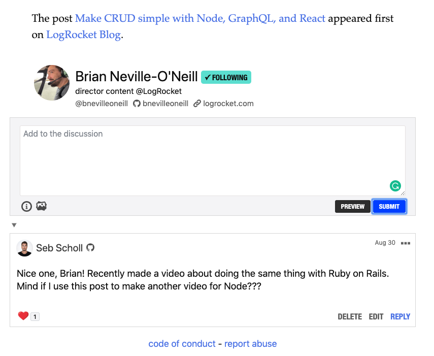
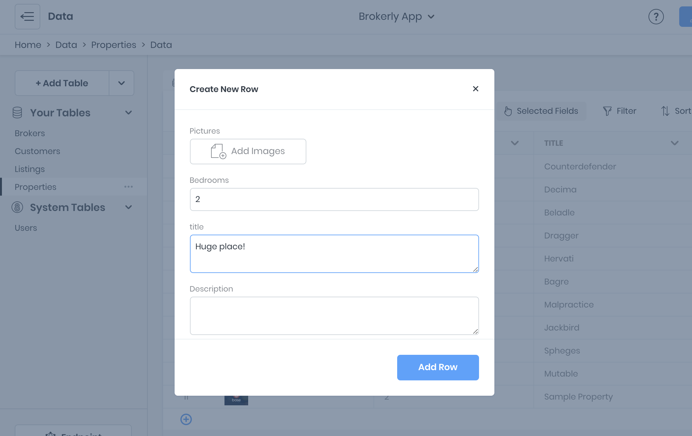

# API Explorer

The *API Explorer* is an in-browser IDE for exploring a workspace's GraphQL API. 

## Adding Records
New table records can be added using the "+" button next to the table name. A form modal will appear which displays all table fields. All validations specified in the schema definition are enforced while using the data viewer.

