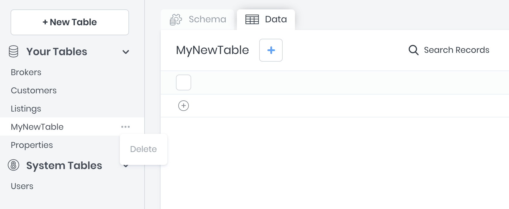

# Data Builder

The 8base Data Builder is a data modeling UI for defining database tables, field types, and relationships between tables. For each table defined, the 8base GraphQL engine creates GraphQL schema object types and the corresponding query, mutation, and subscription fields with resolvers automatically. 

This means that all Create, Read, Update, and Delete (CRUD) actions, as well as real-time connections (websockets) are immediately available to use via the workspace's unique API endpoint. 

Data Builder is found in the management console's `Data` view. It is packed with cool features. For example, `File` field type allows you to seamlessly attach files to records and `Smart` fields make it simple to implement complex validations for addresses or phone number.

## Tables
In the background, 8base spins up an Aurora MySQL database instance for your workspace. Aurora is a relational database that can handle complex queries and is ACID (Atomicity, Consistency, Isolation, Durability). When tables are created, updated, and deleted in a workspace, 8base handles the corresponding migrations and executes them immediately against the database. Therefore, you're database is always reflected by the *Data Builder* UI - showing all available fields, validations, tables, and relations.

### Creating Tables
New tables get created using the "+ New Table" button. An input that prompts for a *name* value will appear, with which the table can named. All tables require unique names.

As soon as a table gets created, corresponding GraphQL schema types and query, mutation, and subscription resolvers will be generated automatically.

### Updating Tables
After a table gets created, fields and relations can get defined. All updates to a table are published in real-time, giving a seemless experience between defining a data model and having it be highly available. 

As soon as a table gets updated, its corresponding GraphQL schema types and query, mutation, and subscription resolvers will be updated automatically.

To ensure that table related errors and mistakes are minimized, 8base protects against **dozens** of harmful actions. Some of these include:

* A prompt that requires a *Default Value* will appear when changing a non-mandatory field to being mandatory.
* Date, Number, and Text field values are auto-magically converted when an existing field *type* is updated.
* When changing a non-unique field to being unique, current records get validated for having unqiue values.
* Many more!

### Deleting Tables
A confirmation input that requires the table name to be typed in appears when attempting to delete a table. Know that deleted tables **cannot** be restored and any existing table records will be lost. Additionally, if any other tables are related to the table being deleted - *belongs to* and *has many*, either specified as mandatory or not - those relations will be severed.

### Table Relationships
8base supports 3-types of table relationships to be defined that are congruent with what to expect from relational databases:

| Type | *A* to *B* | *B* to *B* |
| -- | -- | -- |
| `one-to-one` | Records in table A may `have_one` or `belong_to` records in table B. | Records in table B may `have_one` or `belong_to` records in table A. |
| `one-to-many` | Record in table A may `have_many` records in table B. | Records in table B may `have_one` or `belong_to` records in table A. |
| many-to-many | Record in table A may `have_many` records in table B. | Record in table B may `have_many` records in table A. |

Defining a relationship between two tables can get accomplished by dragging and dropping one table onto another, as well as by selecting `Table` as the Data Type when creating a new table field.

#### Table Configurations
For specifying *has many*, *has one* and *belongs to* relationships between tables.

Configurations
* *Table* - For selecting what table is to get related.
* *Relation Field Name* - The name of the relation as it appears on the **corresponding** table.
* *Allow Multiple X to Y* - Whether the relationship is *has one* or *has many*.
* *Mandatory* - Whether the field relationship is required.
* *Description* - A meta description used for documentation.


##### Self-Referential Relationships

Self-Referential relationships can be defined by relating tables to themselves! For example, a the *Users* table might have a `many-to-many` relationship with itself, and use a named association of *friends*.


### Table Types
There are several types of tables in 8base, each of which offers an important utility.

##### Custom Tables
Custom tables are the tables created in any workspace by the administrator. They are fully customizable and managed by the administrator.

##### System Tables
System tables - like *Users* - are tables that come delivered with a workspace. They are fully extensible, meaning that new fields and relations can be added to them. However, they can neither be deleted, renamed, nor their existing fields changes.

##### View Tables
View Tables are virtual tables that aggregate fields from several or more tables into a single *view*. Under the hood, they are based on the result-set of an SQL statement. In a workspace, they can get created using the `viewCreate` GraphQL mutation in the API Explorer. 

<small>For more information on views, [check this out](https://www.w3schools.com/sql/sql_view.asp).</small>

## Fields
8base offers all database field types required for building software - and some! Fields with the type File, Smart, and others have extended capabilities that streamline specific tasks - such as, managing file/image uploads and validating addresses and phone numbers.

### Creating Fields
Every field gets defined on a table and requires a *name* and a *type*. Field names must be unique on the table, irresepective of their type. Once a new field has been created, a configurations modal will appear allowing for further customizations - each being specific to the field *type*.

### Updating Fields
Fields are easily updated using the same interface used to create them. Updates to attributes like the field's *name* - and even *type* in some cases - are changed in real-time, while changes configurations must be saved. If 8base detects an issue with the change being made, an alert will be display with instructions to remedy the issue.

### Deleting Fields
The "X" found on the right side of a field's name input gets clicked to delete a table. A confirmation modal that requires the field name to be typed in appears when attempting to delete a field. Deleted tables **cannot** be restored and any existing data be lost.

### Field Types
8base offer 8 fields types that can be configured to fit almost any data requirement.

#### Text 
For storing *String* data.

Configurations
* *Field Size* - The maximum string length.
* *Allow Multiple* - Stores 0 or more *Text* values in an array (not searchable).
* *Mandatory* - Whether the field value is required.
* *Unique* - Whether the field value is required to be unique.
* *Default Value* - A default value assigned to new records.
* *Description* - A meta description used for documentation.

#### Number
For storing *Integer*, *BigInt*, and *Float* data.

Configurations
* *Decimal Place* - How many decimal places *Float* values maintain.
* *Big Number* - For numbers outside the range `-2^63 (-9,223,372,036,854,775,808) to 2^63-1 (9,223,372,036,854,775,807)`
* *Minimum Value* - The minimum value required.
* *Maximum Value* - The maximum value required.
* *Allow Multiple* - Stores 0 or more *Number* values in an array (not searchable).
* *Mandatory* - Whether the field value is required.
* *Unique* - Whether the field value is required to be unique.
* *Default Value* - A default value assigned to new records.
* *Description* - A meta description used for documentation.

#### Date
For storing *Date* and *DateTime* data.

Configurations
* *Format* - Whether the field stores a *Date* or a *DateTime* value.
* *Allow Multiple* - Stores 0 or more *Date* values in an array (not searchable).
* *Mandatory* - Whether the field value is required.
* *Unique* - Whether the field value is required to be unique.
* *Default Value* - A default value assigned to new records.
* *Description* - A meta description used for documentation.

#### Switch
For storing *Boolean* and custom *Enum* type data.

Configurations
* *Format* - For specifying the *Boolean* type (true / false, yes / no, etc...)
* *Allow Multiple* - Stores 0 or more *Boolean* values in an array (not searchable).
* *Mandatory* - Whether the field value is required.
* *Default Value* - A default value assigned to new records.
* *Description* - A meta description used for documentation.

#### File
For storing *Image* and *File* objects.

Configurations
* *Format* - Whether the field stores a *File* or an *Image*.
* *Allow Multiple* - Stores 0 or more *File* objects in an array.
* *Mandatory* - Whether the field value is required.
* *Description* - A meta description used for documentation.

#### Table
For specifying *has many*, *has one* and *belongs to* relationships between tables.

Configurations
* *Table* - For selecting what table is to get related.
* *Relation Field Name* - The name of the relation as it appears on the **corresponding** table.
* *Allow Multiple X to Y* - Whether the relationship is *has one* or *has many*.
* *Mandatory* - Whether the field relationship is required.
* *Description* - A meta description used for documentation.

#### Smart
For storing *addresses* and *phone numbers* with managed validations and logic. 

Configurations
* *Format* - Whether the field stores a *Phone Number* or an *Address*.
* *Allow Multiple* - Stores 0 or more *Smart* objects in an array.
* *Mandatory* - Whether the field value is required.
* *Description* - A meta description used for documentation.

#### JSON
For storing *JSON* objects.

Configurations
* *Mandatory* - Whether the field value is required.
* *Default Value* - A default value assigned to new records.
* *Description* - A meta description used for documentation.

