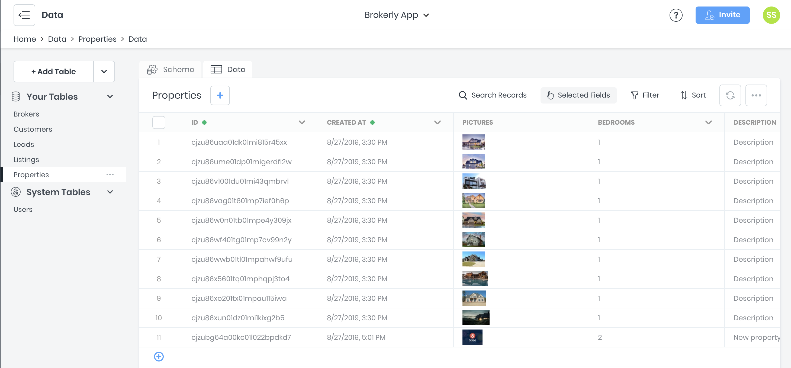

# Data Viewer

While logged into a project's workspace, 8base provides an "Admin Panel" like interface for searching and managing table records. This *Data Viewer* is located within the management console's *Data* screen, tabbed alongside the each tables *Schema*. 

## Adding Records
New table records can get added using the "+" button next to the table name. An form modal will appear that displays all table fields. All validations specified in the schema definition are enforced while using the data viewer.

### Filtering Records
When viewer a table's records, filters can be applied to narrow down the list of record desiplayed. Multiple filters can be added used together. Please know that Data Viewer's filtering UI does not support filtering based on related tables (use API Explorer for advanced filtering).

### Sorting Records
Data records can easily be sorted using one or more sortable attribute. Sort attributes are ranked in the order they were created. Additionally, the filters can be applied to narrow down the list of record desiplayed. Multiple filters can be added used together. The Data Viewer's sorting UI does not support sorting based on related table values - (use API Explorer for advanced sorting).

### Selected Fields
By default, the *id*, *createdAt*, and *updatedAt* field columns are hidden in the Data Viewer. In order to customize which fields and columns display for a given table, simply click on the `[Selected Fields]` dropdown and toggle on/off desired fields.

### Importing Data
Importing data from CSV files is supported and can get opened by clicking the `[Import CSV]` option located in the top-right elipsis dropdown menu. The CSV importer supports column mapping and enforces all schema defined validations on create.

