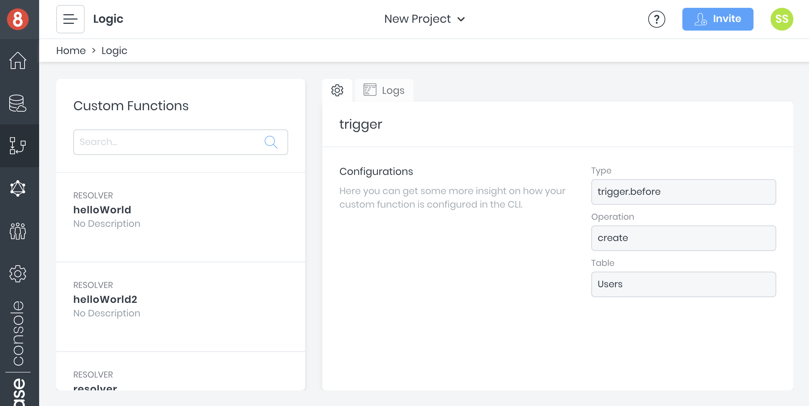
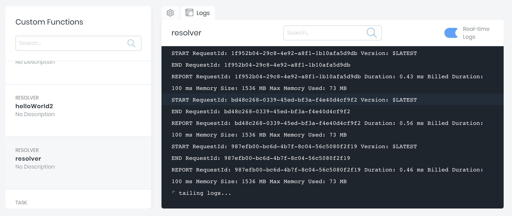

# Logic
The [*Logic*](https://app.8base.com/logic) screen is a dashboard where all [Custom Functions](https://docs.8base.com/8base-console/custom-functions) that have been deployed to a workspace can be reviewed. Consider it your catalog for any custom serverside logic.

## Custom Function Cards
Once custom functions have been deployed to a workspace, they will appear in a list on the left side of the Logic screen. After selecting one, a card for the function will populate.

A quick overview of the function can be collected, showing its `type`, `description`, and any relevant meta data (configurations). Most importantly, clicking on the `Logs` tab will display the functions production logs.

## Logs
Logs can tailed—watched in real time—and searched. To turn on tailing, turn on the "Real Time Logs" toggle. You'll see a prompt in the screen that a connection is/has been established.

Keep in mind that when watching the logs, a short latency period can be expected. Every request made is assigned a unique ID that can be used to search and identify a single request. 

If a `console.log('...something')` statement is used inside of a custom function, the printed result will appear here inside the logs.

## Descriptions and Meta Data
All descriptions and meta data attributed to a function must be added/updated inside the `8base.yml` file. There currently is no support for editing functions in the management console.

Check out the [8base.yml docs](https://docs.8base.com/development-tools/dev-env/8base-yml) to learn more about deploying functions to a workspace.