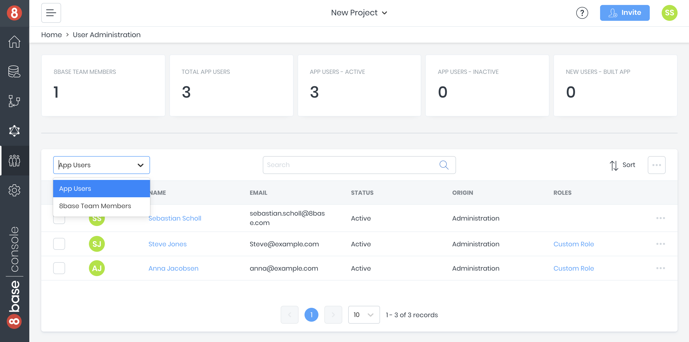
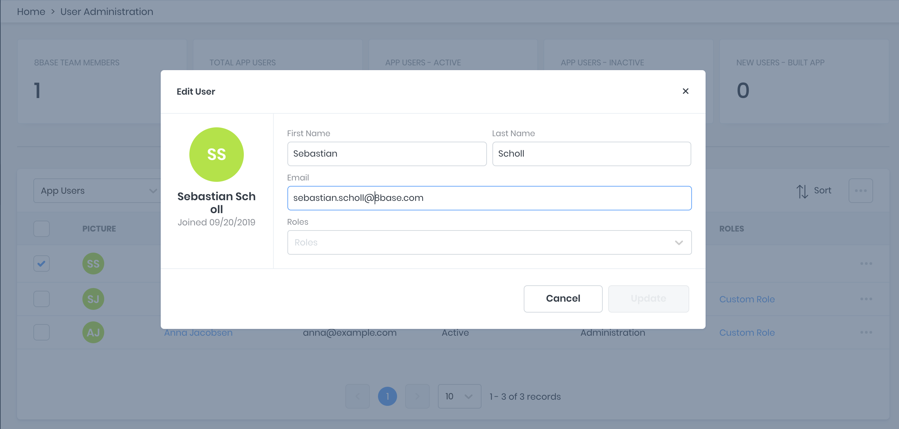

# Users
8base's [User Administration](https://app.8base.com/users) provides the ability to easily view and manage both App User's and Team Members. It also provides some basic insights into how App Users are engaging with your application.



## Users
**Users** is defined as a *System Table* in 8base, meaning that the table is added by default and required in every workspace. That said, it's fully customizable using the Data Builder and can be configured to your application's requirements.

By default, the Users table has the following fields defined.

```javascript
{
    id: ID
    _description: String
    createdAt: DateTime
    updatedAt: DateTime
    createdBy: User
    email: String
    is8base: Boolean
    firstName: String
    lastName: String
    cellPhone: String
    workPhone: String
    workPhoneExt: String
    gender: String
    birthday: String
    language: String
    timezone: String
    avatar: File
    sentInvitations: Array
    permissions: Array
    roles: Array
}
```

### Team Members
When a Team Member gets invited to a workspace, two seperate user records are created for them. The first record is their *Team Member Record* and the second is their *App User Record*.

This is an important distinction to be understood. The roles that get added to the *Team Member User* record determine which permissions the developer has within the Management Console. The permissions that get added to the *App User Record* determine which permissions the developer has within the **application being built**.

If the developer wants to test the application as if their account only had the "Guest" role, they can do so by updating their *App User Record* with the desired role. However, only the workspace administrator is able to update and edit roles belonging to *Team Member Users*.

### App Users
When a user signs up for your application (or is added manually), a role can be added to their user record. This role will determine the priveledges that they have when using the app.

Currently, it is required that users sign up with a valid email address. When using 8base Authentication, a confirmation email will get sent to the user.


### Updating User
When inside the [User Administration](https://app.8base.com/users) user's `firstName`, `lastName`, `email`, and `roles` can be updated. This can be accomplished by clicking `Edit` in the row dropdown and using the popover form as needed.



Many other data points are often being stored about a user. If you need to update other information about the user, you can do so using the [Data Viewer](https://app.8base.com/data/) where you will have access to all user fields.

### Deleting Users
Deleting a user can be done by clicking `delete` in the row drop-down. This action will delete the user record, along with any of its dependent records. 

When using [8base Authentication](https://docs.8base.com/8base-console/authentication#8base-authentication) the user's record will be deleted in both 8base and the authentication provider. When using another authentication provider the user record will **only** be deleted in 8base.

Please refer to the [Authentication docs](https://docs.8base.com/8base-console/authentication) to learn more about this.

### Passwords 
8base does **NOT** store user passwords. Instead, we rely on an authentication provider, like Auth0, to authenticate a user and return a valid `idToken`. That `idToken` contains the users email address, which maps them to a user record in 8base when querying the API.

This is how developers are able to use **any** OpenID provider with their workspace. However, it also means is that things like password resets must be handled by the authentication provider - not 8base.

In the future, we will include some tooling to help manage these concerns from the console.

