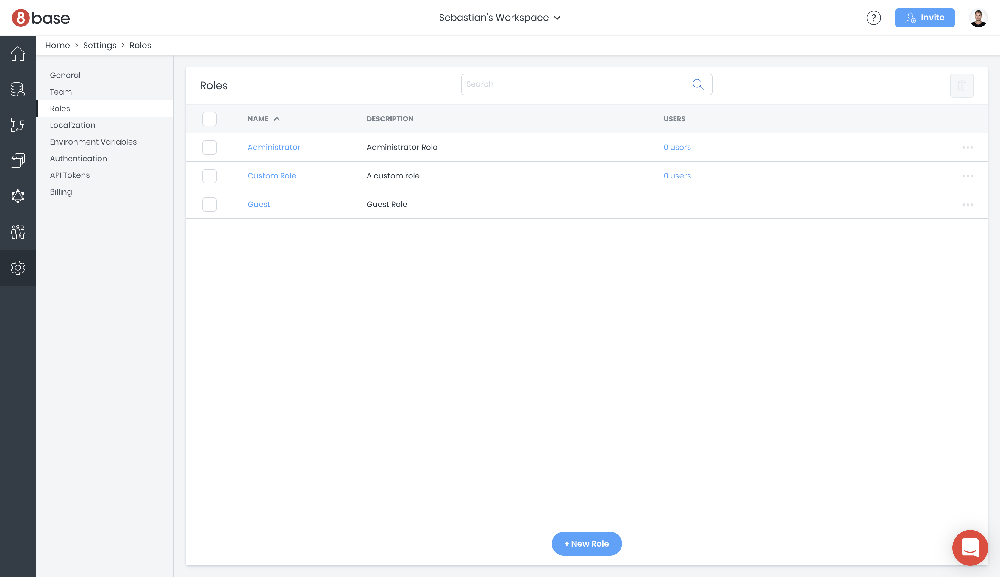
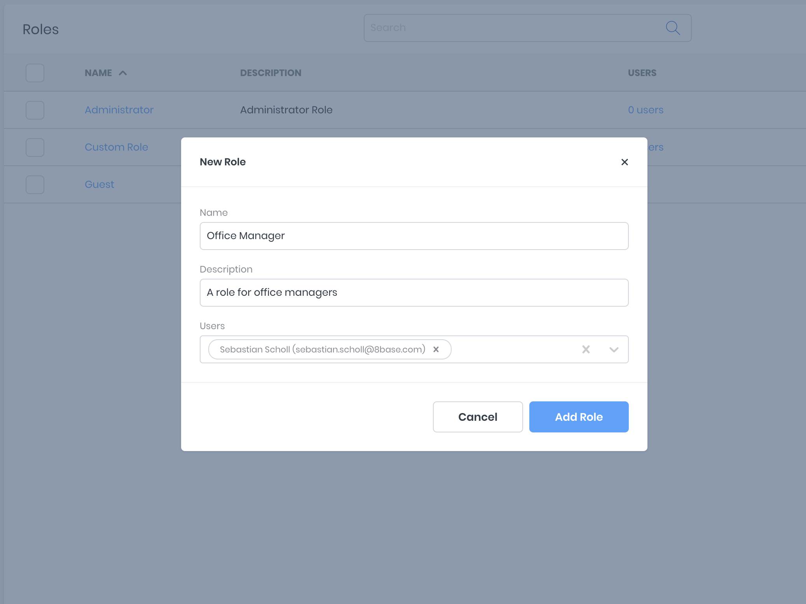
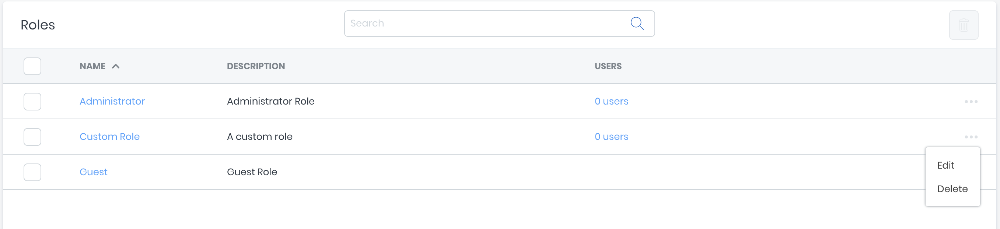
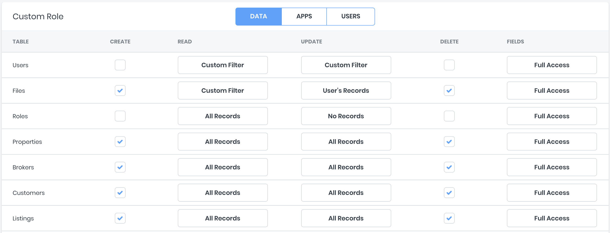
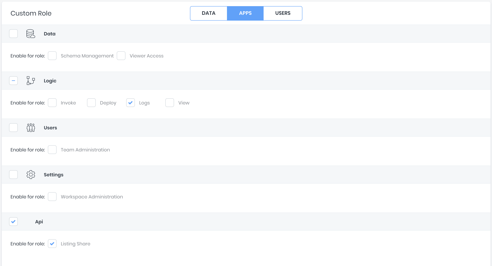
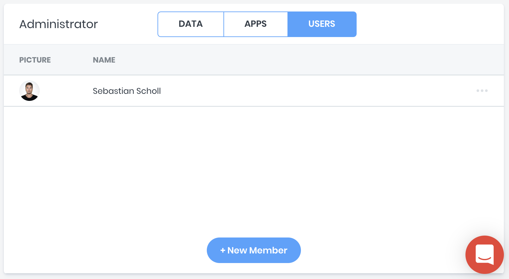

# Authorization

The authorization system in 8base is a robust roles and permissions system that lets you securely control access to any data resources in a workspace. You use the roles and authorization system to control what users (with roles) are able to access and who is authorized (has permission) to do what.

### Managing Roles 

*Roles* in 8base are best described as a single identifier for a collection of *permissions*. A user can have one or more *roles* associated with their account, each of which may allow them to perform zero or more actions.

##### View all Roles

The *Roles* Manager can be found in a given workspace by navigating to `Settings > Roles`. In this view, you can find all 8base and customer defined roles associated with the current workspace. By default, all workspaced are created with two default roles; *Administrator* and *Guest*. 

* **Guest** has no permissions enabled by default
* **Administrator** has all permissions enabled by default

*Note: all roles are fully editable.*

##### Create new Role

Creating a new custom Role is simple. In the Roles Manager view (`Settings > Roles`), click the `+ New Role` button at the bottom of the screen. Add a unique name (required) and a simple description before clicking `Add Role`. You may optionally assign users the new role in the create form. However, this may also be done at anytime in the future once permissions have been specified.

##### Deleting a Role

To delete a role, toggle the elipsis toggle located at the end of the roles table row. Click the `Delete` option and then confirm your action through the modal.

### Managing Permissions

**Permissions** in 8base refer to the specific actions a user is authorized to take. These permission are defined under a *Role*, which is then attributed to a user. For example, a permission that authorizes a user to read *Posts* may be authorized on the *Guest* role.

In the Roles Manager view (`Settings > Roles`), click on the name of a *Role* whose permissions you'd like to update. You'll be taken to a view containing three tabs; *Data*, *Apps* and *Roles*.

##### DATA
Lists all data tables in the current workspace. Each table exposes the ability to to set Create, Read, Update, Delete and Field permissions using simple controls. Should you want to fine tune permissions beyond the scope that's included, `Custom Filters` on tables and `Custom Access` on fields can be implimented.

##### APPS
Allows toggling of role permissions for 8base Managent Console administration, such as Schema Management, Workspace Settings, Team Administration and more.

##### USERS
Lists all users that hold the selected role and allows for easy role assignment and de-assignment to specific users.

*Note: By default, all users are granted the **Guest** role. You may change the name of the Guest role in the edit form.*

