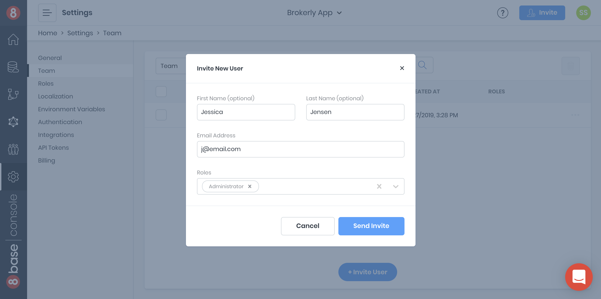
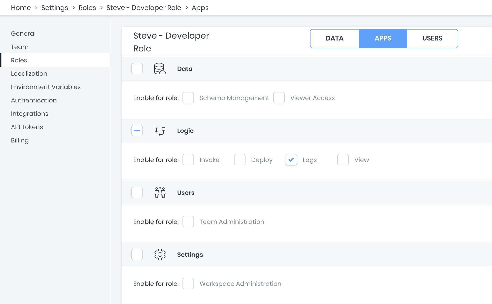
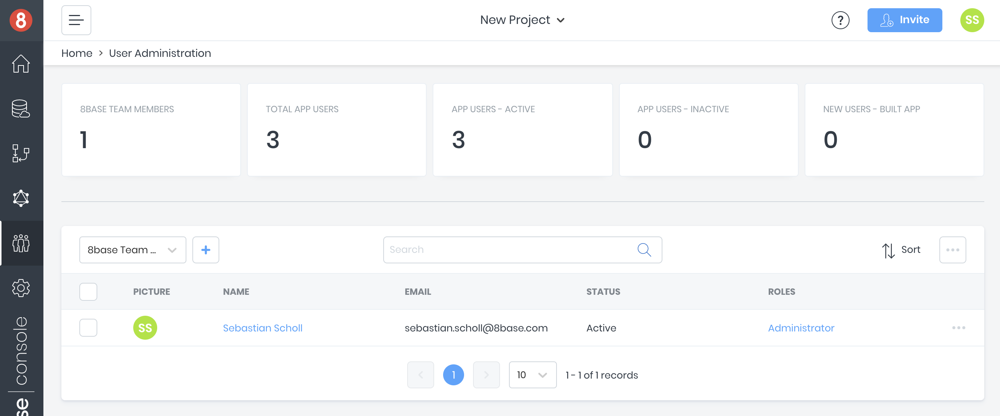

# Teams
Inviting other developers as team members on an 8base workspace is easy. As the workspace owner, you can quickly configure what roles a user has and then invite them to the workspace from within the console. 

### Inviting team members
To invite a team member, navigate to [`Settings > Teams`](https://app.8base.com/settings/team). Click the invite user button to open the invitation form. Once completed, send the invitation and 8base will email the invitee.

### Managing team members
Team members can be updated and removed from a workspace in the [`Settings > Teams`](https://app.8base.com/settings/team) page. Updating a team member's roles will effect their permissions within the current workspace. Deleting a team member will **only** dissasociate a developer from the current workspace; their 8base developer account will remain intact.

To view pending invitations, switch the top left drop-down option to *Invitations*. In this view, team invitations can both be revoked or resent. If a mistake was made in the original invitation, please delete and create a new and correct invitation – pending invitations cannot be edited.

### Roles and permission for team members
The same [roles and permissions](./roles-and-permissions.md) system that is used in authorizing 8base applications is used for team member access management. These roles can be configured so that they are specific to an individual or general to a group. Roles are configued the same way in both of these scenarios. However, let's look at both examples.

##### Developer User Role
In some scenarios, the workspace owner might want to limit the access of an individual developer (Steve) so that they:

1. Are not allowed to edit the data model.
2. Are only allowed to view their own records.

To accomplish this, they'd add a new role in [`Settings > Roles`](https://app.8base.com/settings/roles) called "Steve - Developer Role". Then in the role's data configuration window, they'd update all tables to only allow Steve to read and update *User's Records*. Next, in the role's app configuration window, they'd ensure that *Data: Enable for role: Schema Access* is unchecked.

When inviting the developer as a team member, this new role can be attached to the invitation. Otherwise, it can be attributed to their team member profile once they've accepted the invitation.

##### Developer Group Role
In some scenarios, the workspace owner might want to limit the access of a type of developer (frontend) so that they:

1. Are not allowed to deploy backend logic to the workspace.
2. Are not allowed to administer the workspace.

To accomplish this, they'd add a new role in [`Settings > Roles`](https://app.8base.com/settings/roles) called "Frontend Developer Role". In the role's app configuration window, they'd ensure that *Settings: Enable for role: Workspace Administration* and *Logic: Enable for role: Deploy* are unchecked.

When inviting a frontend developer team member, this new role can be attached to their invitation. Otherwise, it can be attributed to any team members profile once they've accepted the invitation.

### Team Members vs. App Users
When a Team Member is invited to a workspace, two seperate user records are created for them. The first record is their *Team Member Record* and the second is their *App User Record*.

This is an important distinction to be understood. The roles that are added to the *Team Member User* record determine which permissions the developer has within the Management Console. Permissions that are added to the *App User Record* determine which permissions the developer has within the **application being built**.

If the developer wants to test the application as if their account only had the "Guest" role, they can do so by updating their *App User Record* with the desired role. However, only the workspace administrator is able to update and edit roles belonging to *Team Member Users*.

### Troubleshooting
Common issues when inviting team members.

##### 1: The invitation link you clicked is for another account!

Existing 8base developers may already be logged in when accepting an invitation to join another workspace. **If the logged in account's email address is different to that which the invitation was sent to, the invitation will fail**. This issue can very simply be resolved be either:

* Have the developer logout, re-accept the invitation, and create a new account.
* Cancle the invitation and resend a new one to the developer's account email address.

