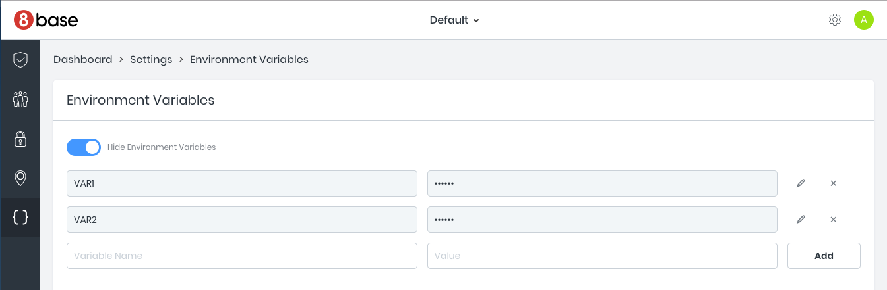

# Environment

## Function arguments 
Each function handler receives two arguments: `event` and `context`. The structure of the `event` object depends on the type of the function and is described in corresponding sections of the docs. The `context` object contains useful properties and methods that are described below. 

### Context object
Functions have a second `context` argument passed to them that has the following properties:

* `workspaceId` property holds the id of the current workspace.
* `context.invokeFunction(taskName, args, options)` allows you to invoke other functions. You can read more about it [here](../../8base-console/custom-functions/README.md).
* `context.api.gqlRequest(query, variables, options)` which provides a convenient way to interact with the 8base GraphQL API. When using the `api.gqlRequest` you don't have to worry about setting the URL or authentication header - this is done automatically. The query is executed under the authentication context of the user that made the request.

### Using `gqlRequest` to call 8base API

The `context.api.gqlRequest` method has the following signature: `gqlRequest(query, variables, options)`. In addition to GraphQL query and variables you can pass the optional `options` argument that has two properties: 

* `authorization` allows you to override the authorization token. For example if you'd like to use an API token instead of the original user authorization token.
* `checkPermissions` - setting it to `false` lets you execute a GraphQL operation with elevated permissions. This is useful when the logic inside of your function requires more permissions than the user making the request. You can think of it as equivalent to `sudo` in Linux.

```javascript
import gql from "graphql-tag";

const query = gql`query customer($id: ID!) {
  customer(id: $id) {
    id
    name
  }
}`;

module.exports = async (event, context) => {
  const { id } = event.data;
  const { customer } = await context.api.gqlRequest(query, { id });
}
```

### Environment variables
You can set environment variables in 8base settings and they automatically get exposed in all functions through `process.env.VARIABLE_NAME`. 



### Timeouts 
Functions have maximum 20 seconds execution time. After execution time limit is reached the execution times out and returns an error. Please let us know if have a use case where you need more than 20 seconds continuous execution 

### What happens after 'return'
After your function returns its execution is immediately frozen. This means that if you have any asynchronous processes still running they will not be able to finish. There are several ways to deal with this:

1. Use `await` to get a result from the asynchronous operation before returning from the function:

```javascript
module.exports = async (event, context) => {
  const response = await context.api.gqlRequest(QUERY);
  return {
    data: JSON.stringify(response)
  }
}
```

2. Return a promise:

```javascript
module.exports = (event: any, context: any) => {
  const promisedResult = new Promise((resolve, reject) => {
    context.api.gqlRequest(QUERY).then((response) => {
      resolve({
        data: JSON.stringify(response)
      });
    });
  });

  return promisedResult;
};
```

3. Spawn a background task that keeps running after your function returns you can use the `context.invokeFunction` API ([described here](../../8base-console/custom-functions/tasks.md)). 

### Managing Dependencies
 You can add any dependencies using `npm` or `yarn`. When you run '8base deploy' command 8base uploads your code to the cloud, runs `npm install` and deploys the bundle to AWS Lambda.

It is recommended that you have `package-lock.json` file to dramatically accelerate deployment. 8base checks whether `package-lock.json` has changed since the last deploy and only installs dependencies when necessary.

