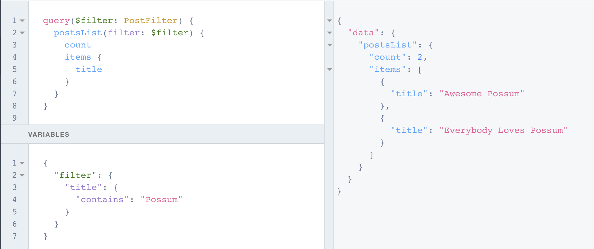

## GraphQL API

*For the sake of the following examples, let's consider a scenario where a table called `Posts` exists, having expected fields and relations like `title`, `body`, `author`, etc.*

### GraphQL API and Basic Concepts
All workspaces in 8base are assigned unique API endpoints. These endpoints handle GraphQL queries, mutations and subscriptions for every data table (covering all Create, Read, Update, Delete operations, plus some...) out-of-the-box.

<!---->
All API Endpoints are structured as so:
`https://api.8base.com/<WORKSPACE_ID>`
<!---->

The API comes pre-configured with filtering, pagination, full-text search and many other advanced features, putting the best tools possible for accessing data in the front-end developer's hands.

*Note: Using [Custom Functions](./custom-functions), these GraphQL resources can be extended and added to in any way seen fit.*

There are several way of retrieving an API endpoint for your workspace. The easiest is to login to the [8base Management Console](https://app.8base.com), select a workspace and copy the `API Endpoint` displayed on the dashboard.


### Understanding Fields
Put simply, GraphQL is a specification for requesting fields on objects. Let's look at a simple 8base query example and the result it returns when run:


```javascript
query {
  author(name: "Huxley") {
    name
    createdAt
  }
}
```


```json
{
  "data": {
    "author": {
      "name": "Huxley",
      "createdAt": "2019-03-21T01:23:34.983Z"
    }
  }
}
```


We see immediately that our result has the same shape as the query. This is key to GraphQL; you always get what you ask for, and the server knows which fields the clients was asking for.

8base GraphQL queries are interactive, and support relational queries natively. This mean two important things, 1) a query can be changed at any time, and 2) related data can be joined without writing complex database queries and serializers (it's handled for you). Let's try another example to demonstrate this.


```javascript
query {
  author(name: "Huxley") {
    name
    posts {
      items {
        id
        title
      }
    }
  }
}
```


```json
{
  "data": {
    "author": {
      "name": "Huxley",
      "posts": {
        "items": [
          {
            "id": "ck08eum6101qf01l9cn6v35v4",
            "title": "Awesome Possum"
          },
          {
            "id": "ck08eve7t01r701l9fsg9a4ow",
            "title": "Pt.2 of the Possum Trilogy"
          }
        ]
      }
    }
  }
}
```


In this previous example, the `createdAt` field was removed from the query and a `posts` parameter added. In the response, we see this reflected by there no longer being a `created` key and the added `posts` array containing its specified parameters - a sub-selection on fields for the related object(s).

### Understanding Arguments
The power of the 8base GraphQL API is further enriched by the ability to specify different arguments when executing a query. This has been demonstrated several times now, where "Huxley" is being passed as an argument to the query (`...author(name: "Huxley")`). When creating data tables in the **Data Builder**, any field marked as *unique* can then be used as an argument for a query.

For example, were the *Posts* table to have the *Title* field set to only permit unique values, we could then query a specific *Post* record like so:

```javascript
{
  post(title: "<POST_TITLE>") {
    title
    body
  }
}
```

### Variables


In order to make a query re-usable, it can be made dynamic by using variables.


```javascript
query($filter: PostFilter) {
  postsList(filter: $filter) {
    count
    items {
      title
    }
  }
}
```



```json
{
  "filter": {
    "title": {
      "contains": "Possum"
    }
  }
}
```


```json
{
  "data": {
    "postsList": {
      "count": 2,
      "items": [
        {
          "title": "Awesome Possum"
        },
        {
          "title": "Everybody Loves Possum"
        }
      ]
    }
  }
}
```


### Aliases
Aliases get used to return objects having different names than their field names. This is needed when fetching the same type of objects with different arguments in a single query.


```javascript
query {
  hux: author(name: "Huxley") {
    name
    posts {
      count
    }
  }
  
  steve: author(name: "Stevens") {
    name
    posts {
      count
    }
  }
}
```


```json
{
  "data": {
    "hux": {
      "name": "Huxley",
      "posts": {
        "count": 2
      }
    },
    "steve": {
      "name": "Stevens",
      "posts": {
        "count": 2
      }
    }
  }
}
```


### Fragments
Queries can get verbose and unorganized. Fragment create a set of fields that can then be used to represent the defined set.


```javascript
query {
  hux: author(name: "Huxley") { ...authorFrag }
  steve: author(name: "Stevens") { ...authorFrag }
}

fragment authorFrag on Author {
  name
  posts {
    count
    items {
      title
      createdAt
      updatedAt
    }
  }
}
```


```json
{
  "data": {
    "hux": {
      "name": "Huxley",
      "posts": {
        "count": 2,
        "items": [
          {
            "title": "Awesome Possum",
            "createdAt": "2019-09-04T22:11:18.493Z",
            "updatedAt": "2019-09-04T22:20:34.650Z"
          },
          {
            "title": "Abominable Snowman Found Dead in Miami Motel",
            "createdAt": "2019-09-04T22:32:50.430Z",
            "updatedAt": "2019-09-04T22:32:50.430Z"
          }
        ]
      }
    },
    "steve": {
      "name": "Stevens",
      "posts": {
        "count": 2,
        "items": [
          {
            "title": "A Sunset and Waves",
            "createdAt": "2019-09-04T22:22:51.846Z",
            "updatedAt": "2019-09-04T22:22:51.846Z"
          },
          {
            "title": "Everybody Loves Possum",
            "createdAt": "2019-09-04T22:26:19.045Z",
            "updatedAt": "2019-09-04T22:26:19.045Z"
          }
        ]
      }
    }
  }
}
```

