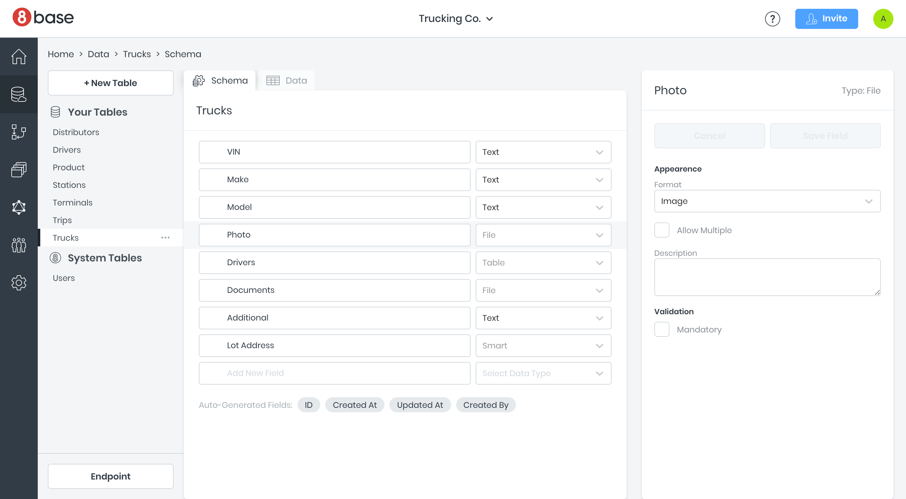
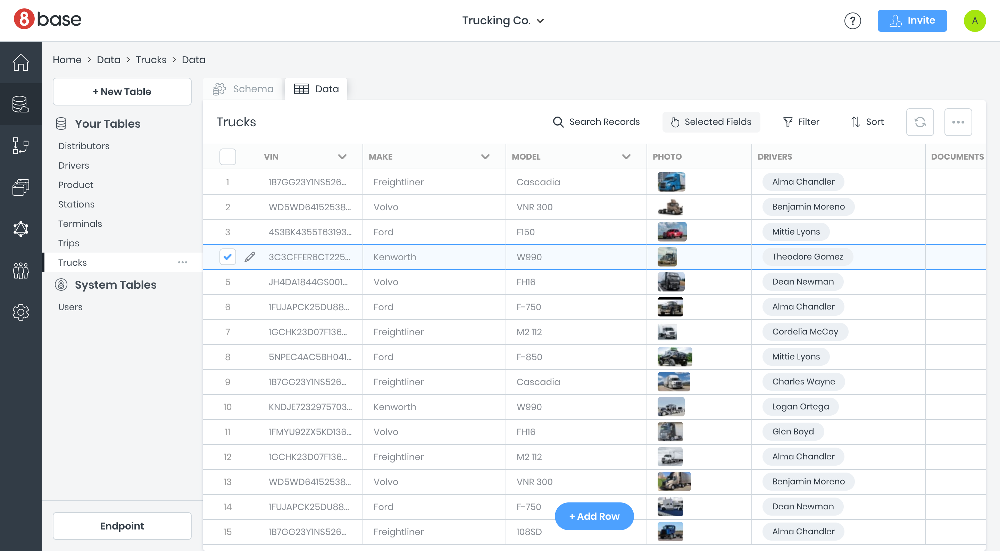
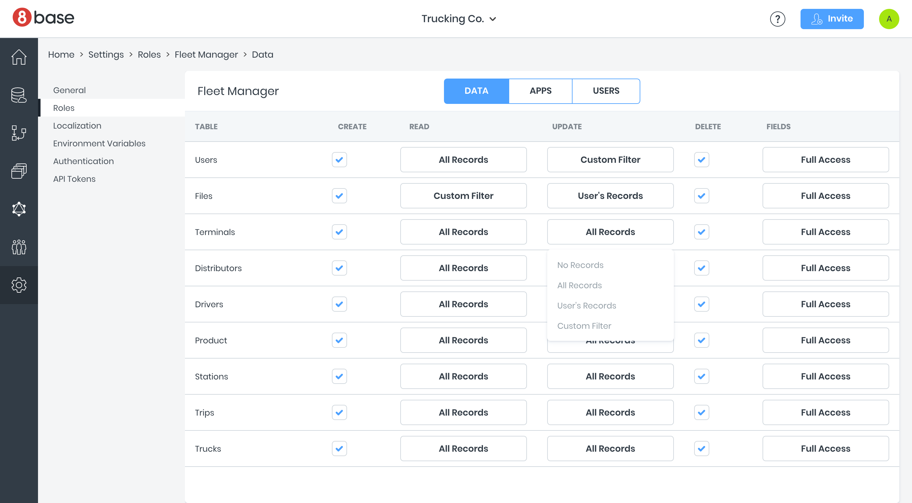
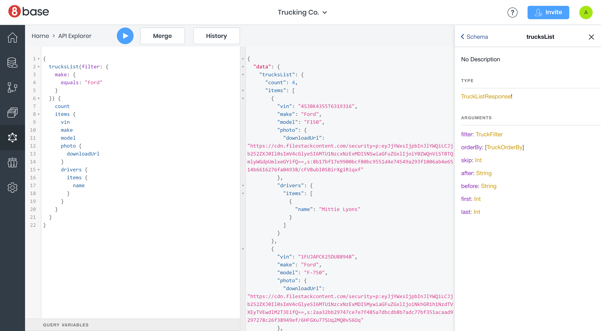
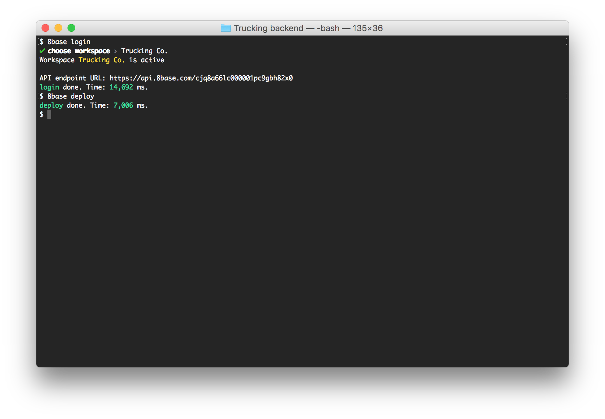

# Platform Tools

8base allows developers to easily launch and manage scalable cloud infrastructures. The platform runs in a serverless, scalable and secure cloud environment powered by AWS and makes it trivial to manage data, files, users, permissions and other features commonly required by modern web and mobile applications.

The 8base platform consists of the following high-level components.

## [Data Builder](./platform-tools/data-builder)

The Data Builder lets you define an applications data model: tables, fields and relationships between tables. It is packed with cool features. For example, `File` fields allow you to seamlessly attach files to data objects, while `Smart` fields make it easy to implement complex validations for addresses and phone numbers.

## [Data Viewer](./platform-tools/data-viewer)

The Data Viewer lets you view and modify data in an table inspired interface. This is useful for admins needing to browse and modify the data, or enter sample content while in development.

## [Role-based Security](./authentication)

Role-based security lets you define custom roles with granular access controls. You can specify which tables and fields a role can read, modify or delete. You can even apply custom filters, such as giving users access only to records they created.

## [GraphQL API](./graphql-api)

The GraphQL API is generated automatically from the data model you define. It gives power to front-end developers to query and modify the data in ways that were traditionally available only to back-end developers. It comes with robust filters, sorting, pagination, full-text search and is secured using the role-based security.

## [CLI](../development-tools/cli)

The Command-line Interface \(CLI\) allows you to develop and deploy custom backend logic in JavaScript or TypeScript. Need to run a custom algorithm, connect to a 3rd-party API, or execute a task on schedule? The CLI lets you deploy this logic in seconds to 8base serverless environment where it is executed and scaled automatically.

## [Client Tools](../development-tools/sdk)

The 8base SDK and Boost UI Kit provide a set of open-source libraries and UI components that simplify and accelerate front-end development. Libraries and UI components are pre-integrated with the 8base API to enable useful features, such as automatically applying client-side validation to form fields based on your data schema, seamless file uploads and more.
