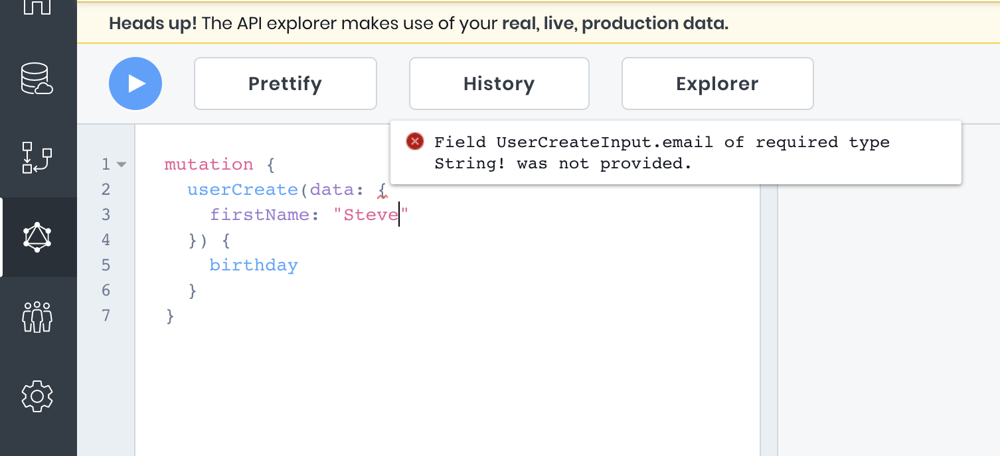
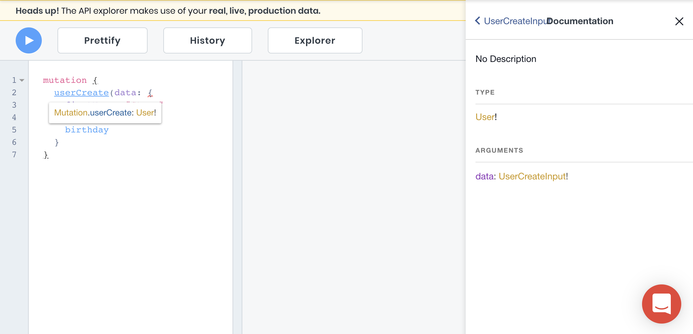
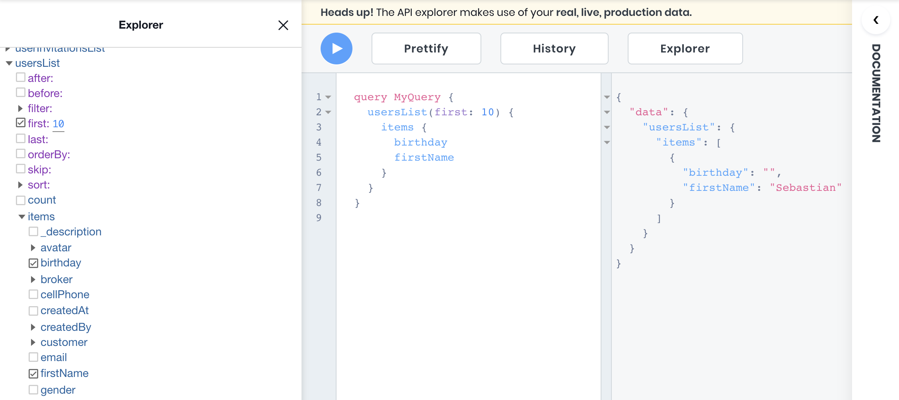

# API Explorer
The [API Explorer](https://app.8base.com/api-explorer) is an in-browser IDE for exploring a workspace's GraphQL API. It allows 8base developers to easily build and execute GraphQL queries from within the workspace.

<!---->
The API Explorer makes use of your **real, live production data!**
<!---->

## Introspection
A GraphQL schema has a built-in introspection system that publishes the schema’s structure. This allows the API Explorer to provide powerful auto-complete features when writing out GraphQL queries. 

To try this for yourself, copy and paste the following code into the textarea in the [API Explorer](https://app.8base.com/api-explorer). 

```javascript
query {
  user
}
```

Once added, reposition the cursor after the "r" in user and press `[OPTION] + [SPACE]`. From here, it's easy to see and select available operations in the API. The auto-complete is contextual to where you are in the query being built, and filters options based on what's being typed.

Additpionally, introspection helps us detect errors in queries. The system recognizes when different types are either not available or incorrectly configured - things like, `Number` should be `String`, field not available on table, as well as validations. Therefore, when using the API Explorer, hover over squiggly-red lines to reveal error tooltips.



## Documentation
Another convenient way to invistigate the many GraphQL operations and types that are available in the current workspace is using the *Documentation*. It can be found on the right side of the screen when in the [API Explorer](https://app.8base.com/api-explorer). By either searching for a specific operation, or drilling down from the top level `query`, `mutation`, and `subscription` types, **all** schema resources can be inspected.

Try opening the *Documentation* by using the `[CMD]` or `[WINDOWS]` key shortcut and clicking on a GraphQL operation. For example, copy and paste the following code into the textarea in the [API Explorer](https://app.8base.com/api-explorer). 

```
mutation {
  userCreate(data: {
    firstName: "Steve"
  }) {
    birthday
  }
}
```

Once added, hold-press the `[CMD]` or `[WINDOWS]` key while hoving over "userCreate" and click. The *Documentation* will open, where we can then investigate the operation.



## Explorer
8base integrated the *Explorer* from [OneGraph](https://www.onegraph.com/) to provide an easily interface for building GraphQL Queries. To open the Explorer, click the "Explorer" button located abover the textarea. The Explorer will open up on screen left. While drilling down into the Explorer list items and clicking the checkboxes, accuracte queries will begin populating the textarea.

Try opening `apiTokenList` and checking the `count` option. The following query will populate the textarea, which can be executed to check how many API tokens exist in the current workspace.

```javascript
query MyQuery {
  apiTokensList {
    count
  }
}
```

Note that argument values can either be typed into to textarea or the Explorer's input fields. Required values in the Explorer are denoted with an asterix (*).


