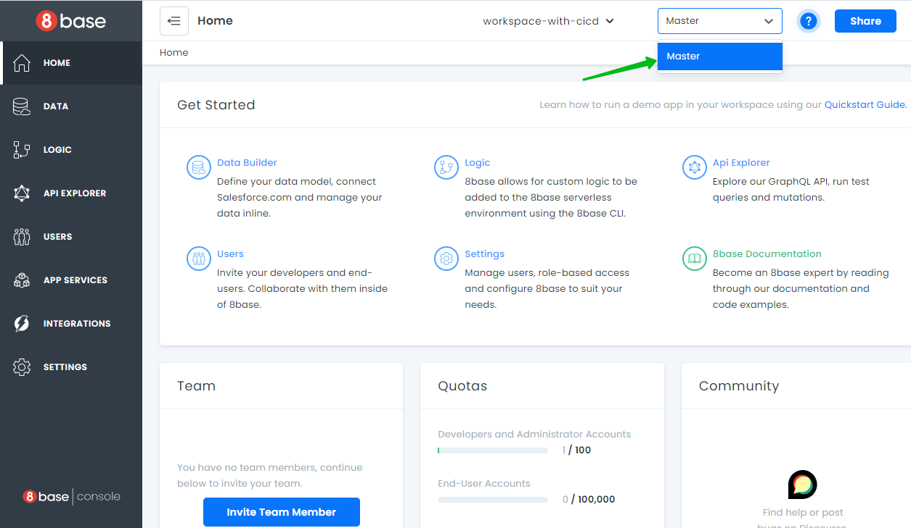

# CI/CD System

Teams that have multiple developers working simultaneously on different features of the same application – or [Workspace](/docs/getting-started#workspaces) – benefit from having isolated development environments for each developer. 8base built CI/CD capabilities natively into the workspace to make this possible!

 On subscription plans where CI/CD is enabled, developers will be able to create up to a specified number of enviroments and graduate changes through their environment pipeline in a [Git](https://git-scm.com/) like fashion.

 ## Getting Started with CI/CD

Make sure that the workspace for which you want CI/CD is subscribed to an [8base plan](https://www.8base.com/pricing) where the feature is enabled. Additionally, ensure that you have the latest version of the 8base CLI installed (or a version later than 0.0.98)

```sh
npm install -g 8base-cli
```

By enabling CI/CD in your Workspace you can create additional Workspace **Environments**.


Only **Master Environment** is available by default.



The process of creating new Environments (cloning one Environment into another) is called **Branching**. Every Environment gets a unique URL/API endpoint that has the following anatomy: `https://app.8base.com/<workspace_id>_<environment_name>`. There is no need to add `<environment_name>` to your URL for requesting *Master* Environment.

### Environment rules

1. Environments are inheritable.
2. You CANNOT manually change *System Parts* of parent Environments after Branching (for example, one Environment can’t be manually changed after another is created from it).
3. You CAN manually change *System Parts* and deploy in child Environments (inheritors).
4. Every Environment can have up to 3-inheritors.

Changing/deploying to parent Environments is only possible with [Migration logic](/docs/development-tools/cli/ci-cd#migrations-logic-and-commands).

You can read more about [System Parts](/docs/getting-started#system-parts) and [User Parts](/docs/getting-started#user-parts) of 8base in our [overview section](/docs/getting-started#8base-application-structure).

## CI/CD Commands

The CI/CD System is controlled using the [8base CLI](/docs/development-tools/cli). There are 3 command categories that correspond to the main components of the CI/CD System; *Environment commands*, *Migrations commands*, and *Backup commands*.

### Environment Commands

##### Creating New Environments

To create a new environment, use the following command.

```sh
8base environment branch

# DESCRIPTION
#   Create new branch from current environment.

# OPTIONS
#   --debug, -d Turn on debug logs [boolean]
#   --help, -h Show help [boolean]
#   --name, -n Name of new environment [string][required]
#   --mode, -m The deploy mode [string][choices: "full", "system"] [default: "FULL"]
```

Using example:
```
# Branch new environment with `<env_name>` from currently set environment in one of the two modes.

8base environment branch -n <env_name> -m FULL/SYSTEM
```

Two modes of environment branching are available:

1. **SYSTEM Mode**: When branching in SYSTEM mode, only [System Part](/docs/getting-started#system-parts) of the Environment get cloned.
2. **FULL Mode**: When branching in FULL mode, both [System and User Parts](/docs/getting-started#user-parts) of the Environment get cloned.

Once the new environment is created you will automatically be moved into it. At any time you can check the current environment by running `8base environment show`.


```sh
8base environment show

# DESCRIPTION
#   Display current environment.

# OPTIONS
#   --debug, -d Turn on debug logs [boolean]
#   --help, -h Show help [boolean]
```

Use `8base environment list` to see all of your environments.

```sh
8base environment list

# DESCRIPTION
#   List all of your workspace environments.

# OPTIONS
#   --debug, -d Turn on debug logs [boolean]
#   --help, -h Show help [boolean]
```

_**Note: For a list of all environment commands with their associated options, run `8base environment --help` in your terminal.**_

##### Switching between Environments

You can switch between environments when using the CLI by running the following set command and selecting from the terminal list.

```sh
8base environment set

# DESCRIPTION
#   Set the current environment in your terminal.

# OPTIONS
#   --debug, -d Turn on debug logs [boolean]
#   --help, -h Show help [boolean]
#   --environmentName, -n The environment name of the project [string]
```

##### Deleting Environments

To delete an environment, run the following command - keeping in mind the *Master* environment cannot be deleted.

```sh
8base environment delete

# DESCRIPTION
#   Delete a workspace environment.

# OPTIONS
#   --debug, -d Turn on debug logs [boolean]
#   --help, -h Show help [boolean]
#   --name, -n Name of deleted environment [string][required]
```

### Migrations Logic and Commands


Making changes and deploying to parent Environments is only possible with **Migration logic**.

Basically, *Migrations* are the files in the ‘migrations’ directory of your local project (`../<localProjectName>/migrations/`) which describe all the changes in [Schema and/or System/User Data](/docs/getting-started).


##### Migration file structure

Migration file naming pattern: `<time>-<data/<application-part>-<post-fix>.ts`

Migration file script:

```sh
import { Context, MigrationVersion } from "./typing.v1";
export const version: MigrationVersion = "v1";
export const up = async (context: Context) => {};
```

`Context` consists of methods for Schema/Data changing and a method for executing GraphQL requests.

The `up` function and `version` variable (`v1` for the version one of migration version) must be defined in every migration. There is a `CiCdMigrations` table that contains all of the already committed migration's in every Workspace environment.

### Commands for migration workflow


##### Generating Migrations

When changes have been made to your current workspace environment and you're ready to migrate them to a different environment, you'll want to generate a migration file that captures all the changes that have been made. To do so, run the following command:

```sh
8base migration generate

# OPTIONS
#   --debug, -d Turn on debug logs [boolean]
#   --help, -h Show help [boolean]
#   --dist The folder of migrations [string][default: "./migrations"]
#   --tables, -t Specify table names to generate migrations for data. [array]
#   --environment, -e Target environment
```

It generates new migration files in your local `migrations` project directory.

These are automatically generated by the server after changes are made in a set Environment (for example - a new table is added). Developers can also manually create their own migration files and commit them directly to specified environments.

Generating migrations for data in the User's tables occurs differently. For User data, you must specify a *table name* flag in command argument. For example:
`migration generate -t <tableName>` Note that this kind of migration returns the whole state of the requested table's records without any comparison to the target Environment.  


##### Committing Migrations

Once a migration has been generated, you'll be able to commit it so that the changes propagate to the specified environment. You can see the list of migrations to be committed by running following:

```sh
8base migration status

# DESCRIPTION
#   Display migration status.

# OPTIONS
#   --debug, -d Turn on debug logs [boolean]
#   --help, -h Show help [boolean]
#   --environment, -e Target environment [string]
```

This command shows the difference between your local migration files and any migrations committed to target Environment (migrations of `CiCdMigrations` table). You can check migrations to be committed with `migration status` and easily delete any you don’t need/want in your Schema/Data.

Once you're ready to commit just run:

```sh
8base migration commit

# OPTIONS
#   --debug, -d Turn on debug logs [boolean]
#   --help, -h Show help [boolean]
#   --mode, -m Commit mode. [string][choices: "FULL", "ONLY_MIGRATIONS", "ONLY_PROJECT"] [default: "FULL"]
#   --force, -f You can specify force flag to commit to master without prompt.
#   --environment, -e Specify the environment you want to commit.
```

This will apply local migrations files to target Environment.

It is important to know that *[Custom Logic (Functions)](/docs/8base-console/custom-functions)* are being deployed by default with any migrations files after `migration commit` is run. You can change this default behavior by specifying a commit mode:

- `--mode FULL` - commits migration files AND Custom Logic (Functions)
- `--mode ONLY_MIGRATIONS` - commits only migration (without Custom Logic)
- `--mode ONLY_PROJECT` - commits only Custom Logic (without migration files)

If you are committing changes to the master branch, you will be prompted to confirm the changes. Otherwise, the commit will take place without any confirmation.

_**Note: For a list of all migration commands with their associated options, run `8base migration --help` in your terminal.**_

### Backups Commands

Sometimes you'll want to take a snapshot of an environment in order to easily restore it at a later date or save it for later reference. This can be accomplished using the following backup commands.

##### 1. backup create

Create a whole backup of current environment. A backup (snapshot) contains full state of the Environment ([System](/docs/getting-started#system-parts) and [User](/docs/getting-started#user-parts) Parts).

```sh
8base backup create

# DESCRIPTION
#   Create a new backup of the environment.

# OPTIONS
#   --debug, -d Turn on debug logs [boolean]
#   --help, -h Show help [boolean]
```

##### 2. backup list

Show available backups for the current environment.

```sh
8base backup list

# DESCRIPTION
#   List all backups for environment.

# OPTIONS
#   --debug, -d Turn on debug logs [boolean]
#   --help, -h Show help [boolean]
```

##### 3. backup restore

Return the state of a current or specified environment to a specified backup. *It is recommended to execute ‘migration commit’ command before backuping of Environment.*

```sh
8base backup restore [OPTIONS].

# DESCRIPTION
#   Restore environment to backup.

# OPTIONS
#   --debug, -d Turn on debug logs [boolean]
#   --help, -h Show help [boolean]
#   --backup, -b The name of the target backup [string][required]
#   --environment, -e Target environment name [string][required]
```

## Basic CI/CD Workflow

A basic CI/CD workflow can resemble something like this:

### Environments

- `Master` - gets used as the "Production" environment (live application backend).
- `Staging` environment gets branched from `Master` (pre go-live backend for testing).
- `Dev` environment gets branched from `Staging` (development backend for whole team).
- `<feature>-Branches` get branched from Dev for single developer or team working on isolated feature.

### Feature Development Workflow

1. Developer branches `dev_task_1` from `Dev` environment.
2. Developer executes `8base environment set -n dev_task_1` to switch the new environment.
3. Developer makes changes in the `dev_task_1` environment (for example, new functions).
4. Developer executes `8base migration generate` command (gets migration files for System Data update), reviews generated migration files and makes changes if necessary.
5. Developer switches environment to parent one (`Dev`) by executing `8base environment set -n Dev`
6. Developer checks the difference between `Dev` and his personal feature environment `dev_task_1` by executing `8base migration status -e dev_task_1` and makes sure only needed migrations will get committed.
7. Developer creates backup of the `Dev` snapshot.
8. Developer commits local migrations (and/or _Custom Logic_) by executing `8base migration commit -e Dev -m <commit-mode>`.
