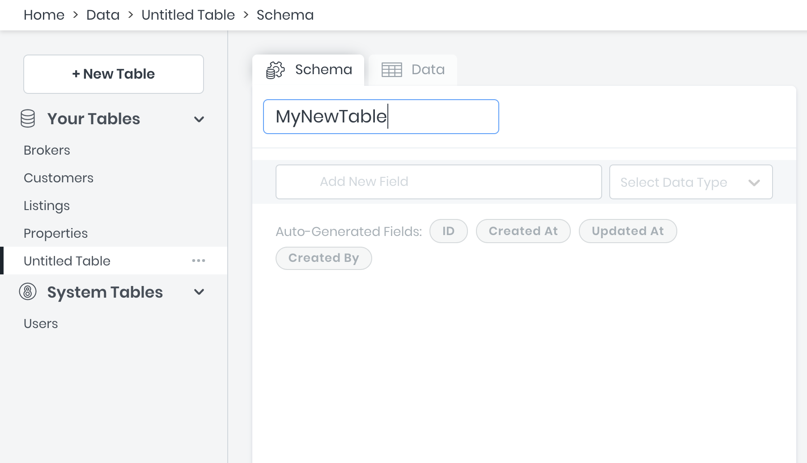
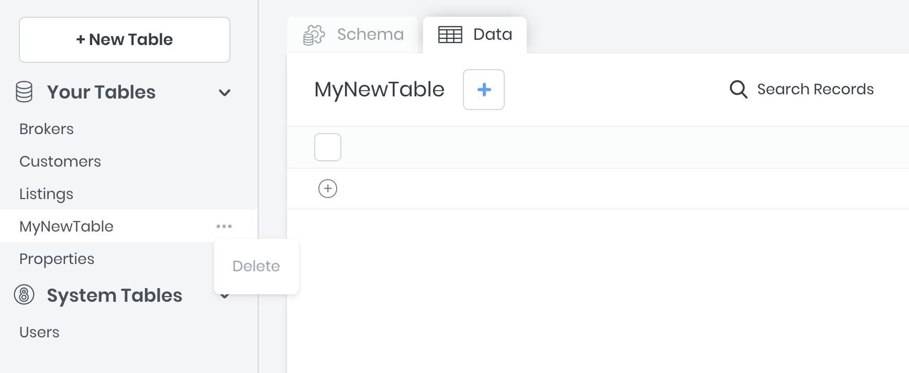
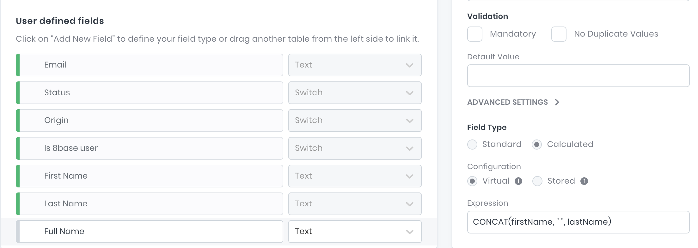

# Data Builder

The 8base Data Builder is a data modeling UI for defining database tables, field types, and relationships between tables. For each table defined, the 8base GraphQL engine creates GraphQL schema object types and the corresponding query, mutation, and subscription fields with resolvers automatically.

This means that all Create, Read, Update, and Delete (CRUD) actions, as well as real-time connections (websockets) are immediately available to use via the workspace's unique API endpoint.

Data Builder is found in the management console's `Data` view. It is packed with cool features. For example, `File` fields allow you to seamlessly attach files to records and `Smart` fields make it easy to implement complex validations for addresses or phone number.


## Tables

In the background, 8base spins up an Aurora MySQL database instance for your workspace. Aurora is a relational database that can handle complex queries and is ACID (Atomicity, Consistency, Isolation, Durability) compliant. When tables are created, updated, and deleted in a workspace, 8base handles the corresponding migrations and executes them immediately against the database. Therefore, you're database is always reflected by the *Data Builder* UI - showing all available fields, validations, tables, and relations.

### Creating Tables

New tables are created using the "+ New Table" button. An input that prompts for a *name* value will appear, with which the table can named. All tables require unique names.

As soon as a table is created, corresponding GraphQL schema types and query, mutation, and subscription resolvers will be generated automatically.



### Creating Table Indexes

To improve look up performance on your tables, you can add one or more of your own indexes. This feature is found in the table settings.

You can select one or several fields in the table by which the index will be generated, as well as whether or not it should be a *Unique Index*. When naming the index, insure that no spaces are used.


### Updating Tables

After a table is created, fields and relations can get defined. All updates to a table are published in real-time, giving a seamless experience between defining a data model and having it be highly available.

As soon as a table is updated, its corresponding GraphQL schema types and query, mutation, and subscription resolvers will be updated automatically.

To ensure that table related errors and mistakes are minimized, 8base protects against **dozens** of harmful actions. Some of these include:

* A prompt that requires a *Default Value* will appear when changing a non-mandatory field to being mandatory.
* Date, Number, and Text field values are auto-magically converted when an existing field *type* is updated.
* When changing a non-unique field to being unique, current records are validated for having unique values.
* Many more!

### Deleting Tables

A confirmation input that requires the table name to be typed in appears when attempting to delete a table. Please know that deleted tables **cannot** be restored and any existing table records will be lost. Additionally, if any other tables are related to the table being deleted - *belongs to* and *has many*, either specified as mandatory or not - those relations will be severed.



### Table Relationships

8base supports 3 types of table relationships to be defined that are congruent with what to expect from relational databases:

| Type | *A* to *B* | *B* to *A* |
| -- | -- | -- |
| `one-to-one` | Records in table A may `have_one` or `belong_to` records in table B. | Records in table B may `have_one` or `belong_to` records in table A. |
| `one-to-many` | Record in table A may `have_many` records in table B. | Records in table B may `have_one` or `belong_to` records in table A. |
| many-to-many | Record in table A may `have_many` records in table B. | Record in table B may `have_many` records in table A. |


Defining a relationship between two tables can be accomplished by dragging and dropping one table onto another, as well as by selecting `Table` as the Data Type when creating a new table field.

#### Table Configurations

For specifying *has many*, *has one* and *belongs to* relationships between tables.

Configurations

* *Table* - For selecting what table is to get related.
* *Relation Field Name* - The name of the relation as it appears on the **corresponding** table.
* *Allow Multiple X to Y* - Whether the relationship is *has one* or *has many*.
* *Mandatory* - Whether the field relationship is required.
* *Description* - A meta description used for documentation.

<!---->
#### Self-Referential Relationships

Self-Referential relationships can be defined by relating tables to themselves! For example, a the *Users* table might have a `many-to-many` relationship with itself, and use a named association of *friends*.
<!--  -->

### Table Types

There are several types of tables in 8base, each of which offers an important utility.

#### Custom Tables

Custom tables are the tables created in any workspace by the administrator. They are fully customizable and managed by the administrator.

#### System Tables

System tables - like *Users* - are tables that come delivered with a workspace. They are fully extensible, meaning that new fields and relations can be added to them. However, they can neither be deleted, renamed, nor their existing fields changes.

#### View Tables

View Tables are virtual tables that aggregate fields from several or more tables into a single *view*. Under the hood, they are based on the result-set of an SQL statement. In a workspace, they can be created using the `viewCreate` GraphQL mutation in the API Explorer. 

For more information on views, [check this out](https://www.w3schools.com/sql/sql_view.asp).

## Fields

8base offers all database field types required for building software - and some! Fields with the type File, Smart, and others have extended capabilities that streamline specific tasks - such as managing file/image uploads and validating addresses and phone numbers.

### Creating Fields

Every field gets defined on a table and requires a *name* and a *type*. Field names must be unique on the table, irrespective of their type. Once a new field has been created, a configurations modal will appear allowing for further customizations - each being specific to the field *type*.

### Updating Fields

Fields are easily updated using the same interface used to create them. Updates to attributes like the field's *name* - and even *type* in some cases - are changed in real-time, while changes configurations must be saved. If 8base detects an issue with the change being made, an alert will be display with instructions to remedy the issue.


### Deleting Fields

The "X" found on the right side of a field's name input gets clicked to delete a table. A confirmation modal that requires the field name to be typed in appears when attempting to delete a field. Deleted tables **cannot** be restored and any existing data be lost.

### Field Types

8base offer 8 field types that can be configured to fit almost any data requirement.

#### Text

For storing *String* data.

Configurations

* *Field Size* - The maximum string length.
* *Allow Multiple* - Stores 0 or more *Text* values in an array (not searchable).
* *Mandatory* - Whether the field value is required.
* *Unique* - Whether the field value is required to be unique.
* *Default Value* - A default value assigned to new records.
* *Description* - A meta description used for documentation.

#### Number

For storing *Integer*, *BigInt*, and *Float* data.

Configurations

* *Decimal Place* - How many decimal places *Float* values maintain.
* *Big Number* - For numbers outside the range `-2^63 (-9,223,372,036,854,775,808) to 2^63-1 (9,223,372,036,854,775,807)`
* *Minimum Value* - The minimum value required.
* *Maximum Value* - The maximum value required.
* *Allow Multiple* - Stores 0 or more *Number* values in an array (not searchable).
* *Mandatory* - Whether the field value is required.
* *Unique* - Whether the field value is required to be unique.
* *Default Value* - A default value assigned to new records.
* *Description* - A meta description used for documentation.

#### Date

For storing *Date* and *DateTime* data.

Configurations

* *Format* - Whether the field stores a *Date* or a *DateTime* value.
* *Allow Multiple* - Stores 0 or more *Date* values in an array (not searchable).
* *Mandatory* - Whether the field value is required.
* *Unique* - Whether the field value is required to be unique.
* *Default Value* - A default value assigned to new records.
* *Description* - A meta description used for documentation.

#### Switch

For storing *Boolean* and custom *Enum* type data.

Configurations

* *Format* - For specifying the *Boolean* type (true / false, yes / no, etc...)
* *Allow Multiple* - Stores 0 or more *Boolean* values in an array (not searchable).
* *Mandatory* - Whether the field value is required.
* *Default Value* - A default value assigned to new records.
* *Description* - A meta description used for documentation.

#### File

For storing *Image* and *File* objects.

Configurations

* *Format* - Whether the field stores a *File* or an *Image*.
* *Allow Multiple* - Stores 0 or more *File* objects in an array.
* *Mandatory* - Whether the field value is required.
* *Description* - A meta description used for documentation.

#### Table

For specifying *has many*, *has one* and *belongs to* relationships between tables.

Configurations

* *Table* - For selecting what table is to get related.
* *Relation Field Name* - The name of the relation as it appears on the **corresponding** table.
* *Allow Multiple X to Y* - Whether the relationship is *has one* or *has many*.
* *Mandatory* - Whether the field relationship is required.
* *Description* - A meta description used for documentation.

#### Smart

For storing *addresses* and *phone numbers* with managed validations and logic. 

Configurations

* *Format* - Whether the field stores a *Phone Number* or an *Address*.
* *Allow Multiple* - Stores 0 or more *Smart* objects in an array.
* *Mandatory* - Whether the field value is required.
* *Description* - A meta description used for documentation.

#### JSON

For storing *JSON* objects.

Configurations

* *Mandatory* - Whether the field value is required.
* *Default Value* - A default value assigned to new records.
* *Description* - A meta description used for documentation.

### Smart Fields

*Smart Fields* are enriched field types offered by 8base. They provide structure, and sometimes logic, to the organization and validation of common data.

#### Address

For persisting addresses in a field. The `address` field will display available fields in the [Data Viewer](/docs/8base-console/platform-tools/data-viewer/) and API Explorer.

```ts
type Address = {
  country: !String
  street1: !String
  street2: String
  zip: !String
  city: !String
  state: !String
}
```

#### Phone

For persisting phone numbers in a field. The `phone` field will display available fields in the [Data Viewer](/docs/8base-console/platform-tools/data-viewer/) and API Explorer.

```ts
type Phone = {
  code: !String
  number: !String
}
```

### Auto Increment Fields

When using *Number* field types, the "Auto-Increment" option is available under the fields *Advanced Settings*.
The system will automatically increment a number value for the field when selected, starting at 1.

Fields that have been created using *Auto Increment* can be deleted, though they are **not** editable via the console or API when in use. Similarly to a integer based Primary Key, the value is always escalating. This means that if five-records are created and receive the values 1-5 in their *Auto Increment* fields, whether or not those records get deleted, the next record will be assigned a value of 6.

### Calculated Fields

Under *Advanced Settings* for field types *Text*, *Number*, *Date*, *Switch*, and *JSON* the "Calculated" option is available. This feature follows the [MySQL Generated Column standard](https://dev.mysql.com/doc/refman/5.7/en/create-table-generated-columns.html).

#### Calculated Field Types

The "Virtual" and "Stored" options will indicate how values are stored, which has the following implications when used:

* *Virtual* - Values are not stored, but are evaluated when rows are read. A virtual column takes no storage.

* *Stored* - Values are evaluated and stored when rows are inserted or updated. A stored column does require storage space and can be indexed.



When creating *Calculated Fields*, you only have access to fields stored on the record itself. Any field can be accessed using the same field names seen on the GraphQL API. The **return value of the calculation must be the same as the set field type**.

For example, adding a *Full Name* field to the User's table could be accomplished using a virtual calculated field with the expression set to `CONCAT(firstName, " ", lastName)`. This would add a `fullName` attribute to our API queries.

```javascript
GqlQuery = `
  query {
    usersList {
      items {
        fullName
      }
    }
  }
`

JsonResponse = {
  "data": {
    "usersList": {
      "items": [
        {
          "fullName": "John Smith"
        }
      ]
    }
  }
}
```

There is a long list of available MySQL Functions that are referenced with further documentation [MySQL Docs. Functions and Operators](https://dev.mysql.com/doc/refman/5.7/en/functions.html), all of which are available when using *Calculated Fields*. All operators, with simple descriptions, are listed below.

| Name | Description |
|------|-------------|
| & | Bitwise AND |
| > | Greater than operator |
| >> | Right shift |
| >= | Greater than or equal operator |
| < | Less than operator |
| <>, != | Not equal operator |
| << | Left shift |
| <= | Less than or equal operator |
| <=> | NULL-safe equal to operator |
| %, MOD | Modulo operator |
| * | Multiplication operator |
| + | Addition operator |
| - | Minus operator |
| - | Change the sign of the argument |
| -> | Return value from JSON column after evaluating path; equivalent to JSON_EXTRACT(). |
| ->> (introduced 5.7.13) | Return value from JSON column after evaluating path and unquoting the result; equivalent to JSON_UNQUOTE(JSON_EXTRACT()). |
| / | Division operator |
| := | Assign a value |
| = | Assign a value (as part of a SET statement, or as part of the SET clause in an UPDATE statement) |
| = | Equal operator |
| ^ | Bitwise XOR |
| ABS() | Return the absolute value |
| ACOS() | Return the arc cosine |
| ADDDATE() | Add time values (intervals) to a date value |
| ADDTIME() | Add time |
| AES_DECRYPT() | Decrypt using AES |
| AES_ENCRYPT() | Encrypt using AES |
| AND, && | Logical AND |
| ANY_VALUE() | Suppress ONLY_FULL_GROUP_BY value rejection |
| Area() (deprecated) | Return Polygon or MultiPolygon area |
| AsBinary(), AsWKB() (deprecated) | Convert from internal geometry format to WKB |
| ASCII() | Return numeric value of left-most character |
| ASIN() | Return the arc sine |
| AsText(), AsWKT() (deprecated) | Convert from internal geometry format to WKT |
| ASYMMETRIC_DECRYPT() | Decrypt ciphertext using private or public key |
| ASYMMETRIC_DERIVE() | Derive symmetric key from asymmetric keys |
| ASYMMETRIC_ENCRYPT() | Encrypt cleartext using private or public key |
| ASYMMETRIC_SIGN() | Generate signature from digest |
| ASYMMETRIC_VERIFY() | Verify that signature matches digest |
| ATAN() | Return the arc tangent |
| ATAN2(), ATAN() | Return the arc tangent of the two arguments |
| AVG() | Return the average value of the argument |
| BENCHMARK() | Repeatedly execute an expression |
| BETWEEN ... AND ... | Whether a value is within a range of values |
| BIN() | Return a string containing binary representation of a number |
| BINARY | Cast a string to a binary string |
| BIT_AND() | Return bitwise AND |
| BIT_COUNT() | Return the number of bits that are set |
| BIT_LENGTH() | Return length of argument in bits |
| BIT_OR() | Return bitwise OR |
| BIT_XOR() | Return bitwise XOR |
| Buffer() (deprecated) | Return geometry of points within given distance from geometry |
| CASE | Case operator |
| CAST() | Cast a value as a certain type |
| CEIL() | Return the smallest integer value not less than the argument |
| CEILING() | Return the smallest integer value not less than the argument |
| Centroid() (deprecated) | Return centroid as a point |
| CHAR() | Return the character for each integer passed |
| CHAR_LENGTH() | Return number of characters in argument |
| CHARACTER_LENGTH() | Synonym for CHAR_LENGTH() |
| CHARSET() | Return the character set of the argument |
| COALESCE() | Return the first non-NULL argument |
| COERCIBILITY() | Return the collation coercibility value of the string argument |
| COLLATION() | Return the collation of the string argument |
| COMPRESS() | Return result as a binary string |
| CONCAT() | Return concatenated string |
| CONCAT_WS() | Return concatenate with separator |
| CONNECTION_ID() | Return the connection ID (thread ID) for the connection |
| Contains() (deprecated) | Whether MBR of one geometry contains MBR of another |
| CONV() | Convert numbers between different number bases |
| CONVERT() | Cast a value as a certain type |
| CONVERT_TZ() | Convert from one time zone to another |
| ConvexHull() (deprecated) | Return convex hull of geometry |
| COS() | Return the cosine |
| COT() | Return the cotangent |
| COUNT() | Return a count of the number of rows returned |
| COUNT(DISTINCT) | Return the count of a number of different values |
| CRC32() | Compute a cyclic redundancy check value |
| CREATE_ASYMMETRIC_PRIV_KEY() | Create private key |
| CREATE_ASYMMETRIC_PUB_KEY() | Create public key |
| CREATE_DH_PARAMETERS() | Generate shared DH secret |
| CREATE_DIGEST() | Generate digest from string |
| Crosses() (deprecated) | Whether one geometry crosses another |
| CURDATE() | Return the current date |
| CURRENT_DATE(), CURRENT_DATE | Synonyms for CURDATE() |
| CURRENT_TIME(), CURRENT_TIME | Synonyms for CURTIME() |
| CURRENT_TIMESTAMP(), CURRENT_TIMESTAMP | Synonyms for NOW() |
| CURRENT_USER(), CURRENT_USER | The authenticated user name and host name |
| CURTIME() | Return the current time |
| DATABASE() | Return the default (current) database name |
| DATE() | Extract the date part of a date or datetime expression |
| DATE_ADD() | Add time values (intervals) to a date value |
| DATE_FORMAT() | Format date as specified |
| DATE_SUB() | Subtract a time value (interval) from a date |
| DATEDIFF() | Subtract two dates |
| DAY() | Synonym for DAYOFMONTH() |
| DAYNAME() | Return the name of the weekday |
| DAYOFMONTH() | Return the day of the month (0-31) |
| DAYOFWEEK() | Return the weekday index of the argument |
| DAYOFYEAR() | Return the day of the year (1-366) |
| DECODE() (deprecated) | Decode a string encrypted using ENCODE() |
| DEFAULT() | Return the default value for a table column |
| DEGREES() | Convert radians to degrees |
| DES_DECRYPT() (deprecated) | Decrypt a string |
| DES_ENCRYPT() (deprecated) | Encrypt a string |
| Dimension() (deprecated) | Dimension of geometry |
| Disjoint() (deprecated) | Whether MBRs of two geometries are disjoint |
| Distance() (deprecated) | The distance of one geometry from another |
| DIV | Integer division |
| ELT() | Return string at index number |
| ENCODE() (deprecated) | Encode a string |
| ENCRYPT() (deprecated) | Encrypt a string |
| EndPoint() (deprecated) | End Point of LineString |
| Envelope() (deprecated) | Return MBR of geometry |
| Equals() (deprecated) | Whether MBRs of two geometries are equal |
| EXP() | Raise to the power of |
| EXPORT_SET() | Return a string such that for every bit set in the value bits, you get an on string and for every unset bit, you get an off string |
| ExteriorRing() (deprecated) | Return exterior ring of Polygon |
| EXTRACT() | Extract part of a date |
| ExtractValue() | Extract a value from an XML string using XPath notation |
| FIELD() | Index (position) of first argument in subsequent arguments |
| FIND_IN_SET() | Index (position) of first argument within second argument |
| FLOOR() | Return the largest integer value not greater than the argument |
| FORMAT() | Return a number formatted to specified number of decimal places |
| FOUND_ROWS() | For a SELECT with a LIMIT clause, the number of rows that would be returned were there no LIMIT clause |
| FROM_BASE64() | Decode base64 encoded string and return result |
| FROM_DAYS() | Convert a day number to a date |
| FROM_UNIXTIME() | Format Unix timestamp as a date |
| GeomCollFromText(), GeometryCollectionFromText() (deprecated) | Return geometry collection from WKT |
| GeomCollFromWKB(), GeometryCollectionFromWKB() (deprecated) | Return geometry collection from WKB |
| GeometryCollection() | Construct geometry collection from geometries |
| GeometryN() (deprecated) | Return N-th geometry from geometry collection |
| GeometryType() (deprecated) | Return name of geometry type |
| GeomFromText(), GeometryFromText() (deprecated) | Return geometry from WKT |
| GeomFromWKB(), GeometryFromWKB() (deprecated) | Return geometry from WKB |
| GET_FORMAT() | Return a date format string |
| GET_LOCK() | Get a named lock |
| GLength() (deprecated) | Return length of LineString |
| GREATEST() | Return the largest argument |
| GROUP_CONCAT() | Return a concatenated string |
| GTID_SUBSET() | Return true if all GTIDs in subset are also in set; otherwise false. |
| GTID_SUBTRACT() | Return all GTIDs in set that are not in subset. |
| HEX() | Hexadecimal representation of decimal or string value |
| HOUR() | Extract the hour |
| IF() | If/else construct |
| IFNULL() | Null if/else construct |
| IN() | Whether a value is within a set of values |
| INET_ATON() | Return the numeric value of an IP address |
| INET_NTOA() | Return the IP address from a numeric value |
| INET6_ATON() | Return the numeric value of an IPv6 address |
| INET6_NTOA() | Return the IPv6 address from a numeric value |
| INSERT() | Insert substring at specified position up to specified number of characters |
| INSTR() | Return the index of the first occurrence of substring |
| InteriorRingN() (deprecated) | Return N-th interior ring of Polygon |
| Intersects() (deprecated) | Whether MBRs of two geometries intersect |
| INTERVAL() | Return the index of the argument that is less than the first argument |
| IS | Test a value against a boolean |
| IS_FREE_LOCK() | Whether the named lock is free |
| IS_IPV4() | Whether argument is an IPv4 address |
| IS_IPV4_COMPAT() | Whether argument is an IPv4-compatible address |
| IS_IPV4_MAPPED() | Whether argument is an IPv4-mapped address |
| IS_IPV6() | Whether argument is an IPv6 address |
| IS NOT | Test a value against a boolean |
| IS NOT NULL | NOT NULL value test |
| IS NULL | NULL value test |
| IS_USED_LOCK() | Whether the named lock is in use; return connection identifier if true |
| IsClosed() (deprecated) | Whether a geometry is closed and simple |
| IsEmpty() (deprecated) | Placeholder function |
| ISNULL() | Test whether the argument is NULL |
| IsSimple() (deprecated) | Whether a geometry is simple |
| JSON_APPEND() (deprecated) | Append data to JSON document |
| JSON_ARRAY() | Create JSON array |
| JSON_ARRAY_APPEND() | Append data to JSON document |
| JSON_ARRAY_INSERT() | Insert into JSON array |
| JSON_ARRAYAGG() (introduced 5.7.22) | Return result set as a single JSON array |
| JSON_CONTAINS() | Whether JSON document contains specific object at path |
| JSON_CONTAINS_PATH() | Whether JSON document contains any data at path |
| JSON_DEPTH() | Maximum depth of JSON document |
| JSON_EXTRACT() | Return data from JSON document |
| JSON_INSERT() | Insert data into JSON document |
| JSON_KEYS() | Array of keys from JSON document |
| JSON_LENGTH() | Number of elements in JSON document |
| JSON_MERGE() (deprecated 5.7.22) | Merge JSON documents, preserving duplicate keys. Deprecated synonym for JSON_MERGE_PRESERVE() |
| JSON_MERGE_PATCH() (introduced 5.7.22) | Merge JSON documents, replacing values of duplicate keys |
| JSON_MERGE_PRESERVE() (introduced 5.7.22) | Merge JSON documents, preserving duplicate keys |
| JSON_OBJECT() | Create JSON object |
| JSON_OBJECTAGG() (introduced 5.7.22) | Return result set as a single JSON object |
| JSON_PRETTY() (introduced 5.7.22) | Print a JSON document in human-readable format |
| JSON_QUOTE() | Quote JSON document |
| JSON_REMOVE() | Remove data from JSON document |
| JSON_REPLACE() | Replace values in JSON document |
| JSON_SEARCH() | Path to value within JSON document |
| JSON_SET() | Insert data into JSON document |
| JSON_STORAGE_SIZE() (introduced 5.7.22) | Space used for storage of binary representation of a JSON document |
| JSON_TYPE() | Type of JSON value |
| JSON_UNQUOTE() | Unquote JSON value |
| JSON_VALID() | Whether JSON value is valid |
| LAST_DAY | Return the last day of the month for the argument |
| LAST_INSERT_ID() | Value of the AUTOINCREMENT column for the last INSERT |
| LCASE() | Synonym for LOWER() |
| LEAST() | Return the smallest argument |
| LEFT() | Return the leftmost number of characters as specified |
| LENGTH() | Return the length of a string in bytes |
| LIKE | Simple pattern matching |
| LineFromText(), LineStringFromText() (deprecated) | Construct LineString from WKT |
| LineFromWKB(), LineStringFromWKB() (deprecated) | Construct LineString from WKB |
| LineString() | Construct LineString from Point values |
| LN() | Return the natural logarithm of the argument |
| LOAD_FILE() | Load the named file |
| LOCALTIME(), LOCALTIME | Synonym for NOW() |
| LOCALTIMESTAMP, LOCALTIMESTAMP() | Synonym for NOW() |
| LOCATE() | Return the position of the first occurrence of substring |
| LOG() | Return the natural logarithm of the first argument |
| LOG10() | Return the base-10 logarithm of the argument |
| LOG2() | Return the base-2 logarithm of the argument |
| LOWER() | Return the argument in lowercase |
| LPAD() | Return the string argument, left-padded with the specified string |
| LTRIM() | Remove leading spaces |
| MAKE_SET() | Return a set of comma-separated strings that have the corresponding bit in bits set |
| MAKEDATE() | Create a date from the year and day of year |
| MAKETIME() | Create time from hour, minute, second |
| MASTER_POS_WAIT() | Block until the slave has read and applied all updates up to the specified position |
| MATCH | Perform full-text search |
| MAX() | Return the maximum value |
| MBRContains() | Whether MBR of one geometry contains MBR of another |
| MBRCoveredBy() | Whether one MBR is covered by another |
| MBRCovers() | Whether one MBR covers another |
| MBRDisjoint() | Whether MBRs of two geometries are disjoint |
| MBREqual() (deprecated) | Whether MBRs of two geometries are equal |
| MBREquals() | Whether MBRs of two geometries are equal |
| MBRIntersects() | Whether MBRs of two geometries intersect |
| MBROverlaps() | Whether MBRs of two geometries overlap |
| MBRTouches() | Whether MBRs of two geometries touch |
| MBRWithin() | Whether MBR of one geometry is within MBR of another |
| MD5() | Calculate MD5 checksum |
| MICROSECOND() | Return the microseconds from argument |
| MID() | Return a substring starting from the specified position |
| MIN() | Return the minimum value |
| MINUTE() | Return the minute from the argument |
| MLineFromText(), MultiLineStringFromText() (deprecated) | Construct MultiLineString from WKT |
| MLineFromWKB(), MultiLineStringFromWKB() (deprecated) | Construct MultiLineString from WKB |
| MOD() | Return the remainder |
| MONTH() | Return the month from the date passed |
| MONTHNAME() | Return the name of the month |
| MPointFromText(), MultiPointFromText() (deprecated) | Construct MultiPoint from WKT |
| MPointFromWKB(), MultiPointFromWKB() (deprecated) | Construct MultiPoint from WKB |
| MPolyFromText(), MultiPolygonFromText() (deprecated) | Construct MultiPolygon from WKT |
| MPolyFromWKB(), MultiPolygonFromWKB() (deprecated) | Construct MultiPolygon from WKB |
| MultiLineString() | Contruct MultiLineString from LineString values |
| MultiPoint() | Construct MultiPoint from Point values |
| MultiPolygon() | Construct MultiPolygon from Polygon values |
| NAME_CONST() | Cause the column to have the given name |
| NOT, ! | Negates value |
| NOT BETWEEN ... AND ... | Whether a value is not within a range of values |
| NOT IN() | Whether a value is not within a set of values |
| NOT LIKE | Negation of simple pattern matching |
| NOT REGEXP | Negation of REGEXP |
| NOW() | Return the current date and time |
| NULLIF() | Return NULL if expr1 = expr2 |
| NumGeometries() (deprecated) | Return number of geometries in geometry collection |
| NumInteriorRings() (deprecated) | Return number of interior rings in Polygon |
| NumPoints() (deprecated) | Return number of points in LineString |
| OCT() | Return a string containing octal representation of a number |
| OCTET_LENGTH() | Synonym for LENGTH() |
| OR, \|\| | Logical OR |
| ORD() | Return character code for leftmost character of the argument |
| Overlaps() (deprecated) | Whether MBRs of two geometries overlap |
| PASSWORD() (deprecated) | Calculate and return a password string |
| PERIOD_ADD() | Add a period to a year-month |
| PERIOD_DIFF() | Return the number of months between periods |
| PI() | Return the value of pi |
| Point() | Construct Point from coordinates |
| PointFromText() (deprecated) | Construct Point from WKT |
| PointFromWKB() (deprecated) | Construct Point from WKB |
| PointN() (deprecated) | Return N-th point from LineString |
| PolyFromText(), PolygonFromText() (deprecated) | Construct Polygon from WKT |
| PolyFromWKB(), PolygonFromWKB() (deprecated) | Construct Polygon from WKB |
| Polygon() | Construct Polygon from LineString arguments |
| POSITION() | Synonym for LOCATE() |
| POW() | Return the argument raised to the specified power |
| POWER() | Return the argument raised to the specified power |
| PROCEDURE ANALYSE() (deprecated 5.7.18) | Analyze the results of a query |
| QUARTER() | Return the quarter from a date argument |
| QUOTE() | Escape the argument for use in an SQL statement |
| RADIANS() | Return argument converted to radians |
| RAND() | Return a random floating-point value |
| RANDOM_BYTES() | Return a random byte vector |
| REGEXP | Whether string matches regular expression |
| RELEASE_ALL_LOCKS() | Release all current named locks |
| RELEASE_LOCK() | Release the named lock |
| REPEAT() | Repeat a string the specified number of times |
| REPLACE() | Replace occurrences of a specified string |
| REVERSE() | Reverse the characters in a string |
| RIGHT() | Return the specified rightmost number of characters |
| RLIKE | Whether string matches regular expression |
| ROUND() | Round the argument |
| ROW_COUNT() | The number of rows updated |
| RPAD() | Append string the specified number of times |
| RTRIM() | Remove trailing spaces |
| SCHEMA() | Synonym for DATABASE() |
| SEC_TO_TIME() | Converts seconds to 'hh:mm:ss' format |
| SECOND() | Return the second (0-59) |
| SESSION_USER() | Synonym for USER() |
| SHA1(), SHA() | Calculate an SHA-1 160-bit checksum |
| SHA2() | Calculate an SHA-2 checksum |
| SIGN() | Return the sign of the argument |
| SIN() | Return the sine of the argument |
| SLEEP() | Sleep for a number of seconds |
| SOUNDEX() | Return a soundex string |
| SOUNDS LIKE | Compare sounds |
| SPACE() | Return a string of the specified number of spaces |
| SQRT() | Return the square root of the argument |
| SRID() (deprecated) | Return spatial reference system ID for geometry |
| ST_Area() | Return Polygon or MultiPolygon area |
| ST_AsBinary(), ST_AsWKB() | Convert from internal geometry format to WKB |
| ST_AsGeoJSON() | Generate GeoJSON object from geometry |
| ST_AsText(), ST_AsWKT() | Convert from internal geometry format to WKT |
| ST_Buffer() | Return geometry of points within given distance from geometry |
| ST_Buffer_Strategy() | Produce strategy option for ST_Buffer() |
| ST_Centroid() | Return centroid as a point |
| ST_Contains() | Whether one geometry contains another |
| ST_ConvexHull() | Return convex hull of geometry |
| ST_Crosses() | Whether one geometry crosses another |
| ST_Difference() | Return point set difference of two geometries |
| ST_Dimension() | Dimension of geometry |
| ST_Disjoint() | Whether one geometry is disjoint from another |
| ST_Distance() | The distance of one geometry from another |
| ST_Distance_Sphere() | Minimum distance on earth between two geometries |
| ST_EndPoint() | End Point of LineString |
| ST_Envelope() | Return MBR of geometry |
| ST_Equals() | Whether one geometry is equal to another |
| ST_ExteriorRing() | Return exterior ring of Polygon |
| ST_GeoHash() | Produce a geohash value |
| ST_GeomCollFromText(), ST_GeometryCollectionFromText(), ST_GeomCollFromTxt() | Return geometry collection from WKT |
| ST_GeomCollFromWKB(), ST_GeometryCollectionFromWKB() | Return geometry collection from WKB |
| ST_GeometryN() | Return N-th geometry from geometry collection |
| ST_GeometryType() | Return name of geometry type |
| ST_GeomFromGeoJSON() | Generate geometry from GeoJSON object |
| ST_GeomFromText(), ST_GeometryFromText() | Return geometry from WKT |
| ST_GeomFromWKB(), ST_GeometryFromWKB() | Return geometry from WKB |
| ST_InteriorRingN() | Return N-th interior ring of Polygon |
| ST_Intersection() | Return point set intersection of two geometries |
| ST_Intersects() | Whether one geometry intersects another |
| ST_IsClosed() | Whether a geometry is closed and simple |
| ST_IsEmpty() | Placeholder function |
| ST_IsSimple() | Whether a geometry is simple |
| ST_IsValid() | Whether a geometry is valid |
| ST_LatFromGeoHash() | Return latitude from geohash value |
| ST_Length() | Return length of LineString |
| ST_LineFromText(), ST_LineStringFromText() | Construct LineString from WKT |
| ST_LineFromWKB(), ST_LineStringFromWKB() | Construct LineString from WKB |
| ST_LongFromGeoHash() | Return longitude from geohash value |
| ST_MakeEnvelope() | Rectangle around two points |
| ST_MLineFromText(), ST_MultiLineStringFromText() | Construct MultiLineString from WKT |
| ST_MLineFromWKB(), ST_MultiLineStringFromWKB() | Construct MultiLineString from WKB |
| ST_MPointFromText(), ST_MultiPointFromText() | Construct MultiPoint from WKT |
| ST_MPointFromWKB(), ST_MultiPointFromWKB() | Construct MultiPoint from WKB |
| ST_MPolyFromText(), ST_MultiPolygonFromText() | Construct MultiPolygon from WKT |
| ST_MPolyFromWKB(), ST_MultiPolygonFromWKB() | Construct MultiPolygon from WKB |
| ST_NumGeometries() | Return number of geometries in geometry collection |
| ST_NumInteriorRing(), ST_NumInteriorRings() | Return number of interior rings in Polygon |
| ST_NumPoints() | Return number of points in LineString |
| ST_Overlaps() | Whether one geometry overlaps another |
| ST_PointFromGeoHash() | Convert geohash value to POINT value |
| ST_PointFromText() | Construct Point from WKT |
| ST_PointFromWKB() | Construct Point from WKB |
| ST_PointN() | Return N-th point from LineString |
| ST_PolyFromText(), ST_PolygonFromText() | Construct Polygon from WKT |
| ST_PolyFromWKB(), ST_PolygonFromWKB() | Construct Polygon from WKB |
| ST_Simplify() | Return simplified geometry |
| ST_SRID() | Return spatial reference system ID for geometry |
| ST_StartPoint() | Start Point of LineString |
| ST_SymDifference() | Return point set symmetric difference of two geometries |
| ST_Touches() | Whether one geometry touches another |
| ST_Union() | Return point set union of two geometries |
| ST_Validate() | Return validated geometry |
| ST_Within() | Whether one geometry is within another |
| ST_X() | Return X coordinate of Point |
| ST_Y() | Return Y coordinate of Point |
| StartPoint() (deprecated) | Start Point of LineString |
| STD() | Return the population standard deviation |
| STDDEV() | Return the population standard deviation |
| STDDEV_POP() | Return the population standard deviation |
| STDDEV_SAMP() | Return the sample standard deviation |
| STR_TO_DATE() | Convert a string to a date |
| STRCMP() | Compare two strings |
| SUBDATE() | Synonym for DATE_SUB() when invoked with three arguments |
| SUBSTR() | Return the substring as specified |
| SUBSTRING() | Return the substring as specified |
| SUBSTRING_INDEX() | Return a substring from a string before the specified number of occurrences of the delimiter |
| SUBTIME() | Subtract times |
| SUM() | Return the sum |
| SYSDATE() | Return the time at which the function executes |
| SYSTEM_USER() | Synonym for USER() |
| TAN() | Return the tangent of the argument |
| TIME() | Extract the time portion of the expression passed |
| TIME_FORMAT() | Format as time |
| TIME_TO_SEC() | Return the argument converted to seconds |
| TIMEDIFF() | Subtract time |
| TIMESTAMP() | With a single argument, this function returns the date or datetime expression; with two arguments, the sum of the arguments |
| TIMESTAMPADD() | Add an interval to a datetime expression |
| TIMESTAMPDIFF() | Subtract an interval from a datetime expression |
| TO_BASE64() | Return the argument converted to a base-64 string |
| TO_DAYS() | Return the date argument converted to days |
| TO_SECONDS() | Return the date or datetime argument converted to seconds since Year 0 |
| Touches() (deprecated) | Whether one geometry touches another |
| TRIM() | Remove leading and trailing spaces |
| TRUNCATE() | Truncate to specified number of decimal places |
| UCASE() | Synonym for UPPER() |
| UNCOMPRESS() | Uncompress a string compressed |
| UNCOMPRESSED_LENGTH() | Return the length of a string before compression |
| UNHEX() | Return a string containing hex representation of a number |
| UNIX_TIMESTAMP() | Return a Unix timestamp |
| UpdateXML() | Return replaced XML fragment |
| UPPER() | Convert to uppercase |
| USER() | The user name and host name provided by the client |
| UTC_DATE() | Return the current UTC date |
| UTC_TIME() | Return the current UTC time |
| UTC_TIMESTAMP() | Return the current UTC date and time |
| UUID() | Return a Universal Unique Identifier (UUID) |
| UUID_SHORT() | Return an integer-valued universal identifier |
| VALIDATE_PASSWORD_STRENGTH() | Determine strength of password |
| VALUES() | Define the values to be used during an INSERT |
| VAR_POP() | Return the population standard variance |
| VAR_SAMP() | Return the sample variance |
| VARIANCE() | Return the population standard variance |
| VERSION() | Return a string that indicates the MySQL server version |
| WAIT_FOR_EXECUTED_GTID_SET() | Wait until the given GTIDs have executed on the slave. |
| WAIT_UNTIL_SQL_THREAD_AFTER_GTIDS() | Use WAIT_FOR_EXECUTED_GTID_SET(). |
| WEEK() | Return the week number |
| WEEKDAY() | Return the weekday index |
| WEEKOFYEAR() | Return the calendar week of the date (1-53) |
| WEIGHT_STRING() | Return the weight string for a string |
| Within() (deprecated) | Whether MBR of one geometry is within MBR of another |
| X() (deprecated) | Return X coordinate of Point |
| XOR | Logical XOR |
| Y() (deprecated) | Return Y coordinate of Point |
| YEAR() | Return the year |
| YEARWEEK() | Return the year and week |
| \| | Bitwise OR |
| ~ | Bitwise inversion |
