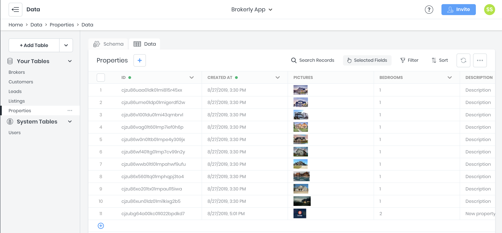
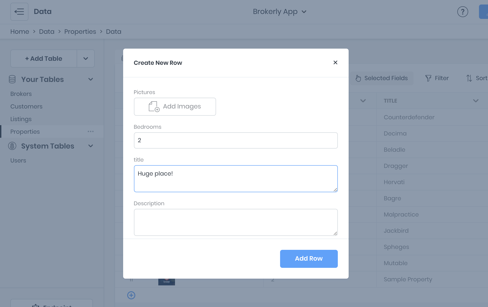
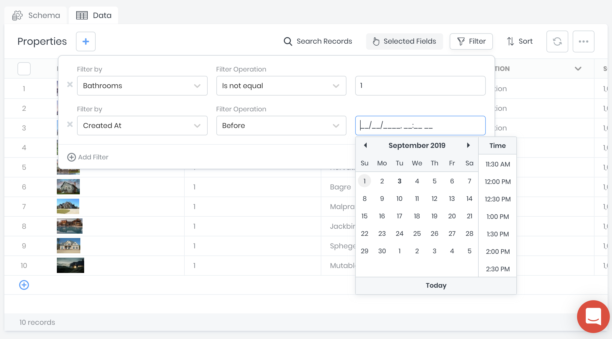
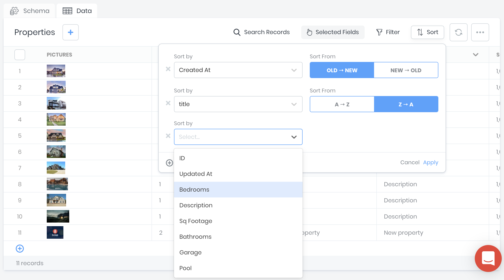
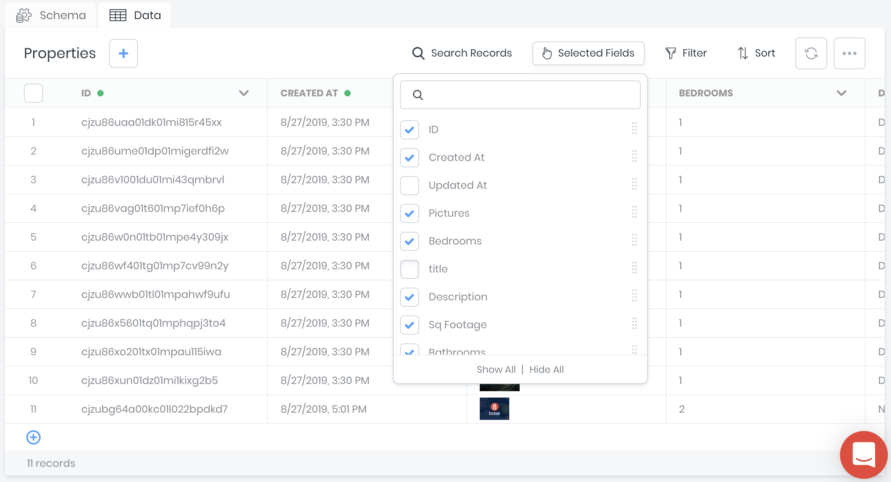

# Data Viewer

While logged into a project's workspace, 8base provides an "Admin Panel" like interface for searching and managing table records. The *Data Viewer* is located within the management console's *Data* screen, tabbed alongside each table's *Schema*. 

## Adding Records
New table records can be added using the "+" button next to the table name. A form modal will appear which displays all table fields. All validations specified in the schema definition are enforced while using the data viewer.

### Filtering Records
When using the Data Viewer, filters can be applied to narrow down the list of record desiplayed. Multiple filters can be added and used together. Please note, the Data Viewer's filtering UI does not support filtering based on related tables. 

Use the API Explorer for advanced table filtering.

### Sorting Records
Data records can be sorted by using one or more sortable attributes. Sort attributes are ranked in the order in which they were created. Additionally, the filters can be applied to narrow down the list of records desiplayed. Multiple filters can be added and used together. Please note, the Data Viewer's sorting UI does not support sorting based on related table values. 

Use API Explorer for advanced table sorting.

### Selected Fields
By default, the *createdAt*, and *updatedAt* field columns are hidden in the Data Viewer. In order to customize which fields and columns display for a given table, simply click on the `[Selected Fields]` dropdown and toggle on/off desired fields.

In the same drop-down, columns can easily be reordered. Simply drag-and-drop this items in the drop-down to any preferred order.

### Importing Data
Importing data from CSV files is supported and can be opened by clicking the `[Import CSV]` option located in the top-right elipsis dropdown menu. The CSV importer supports column mapping and enforces all schema defined validations on create.

Please refer to the [CLI's Import](/docs/development-tools/cli/commands#import) command docs to import more complex data (related records, images, smart fields, etc).

<!--  -->
