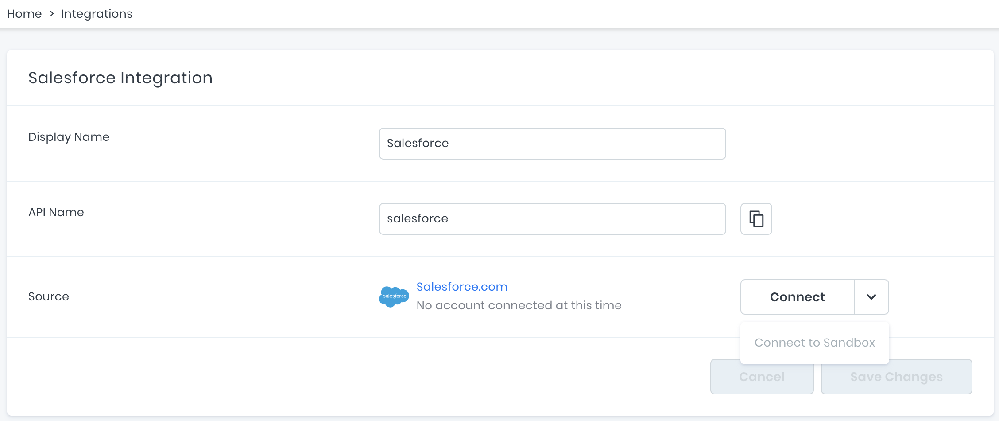
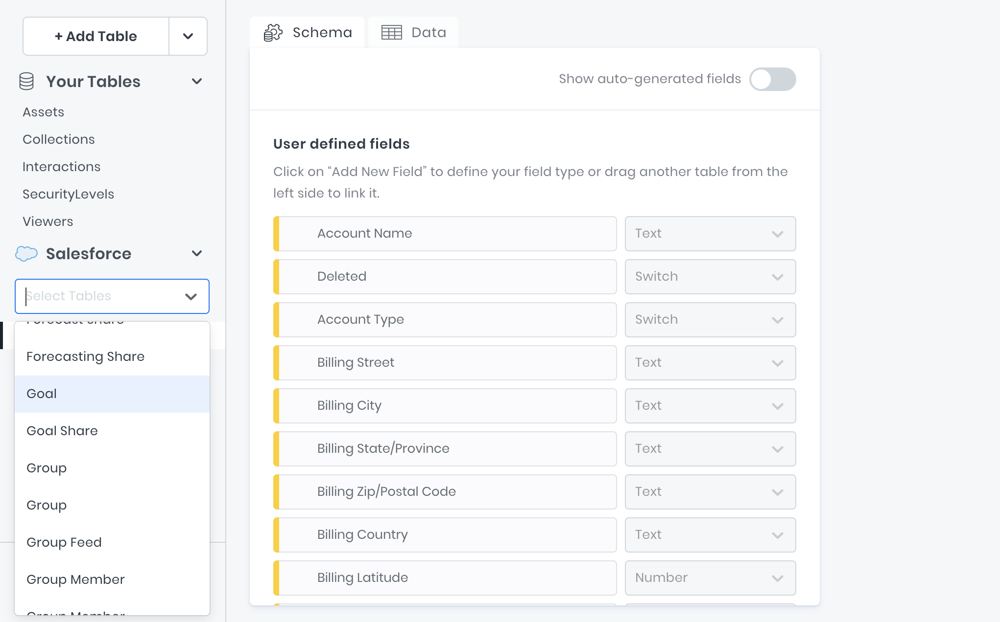
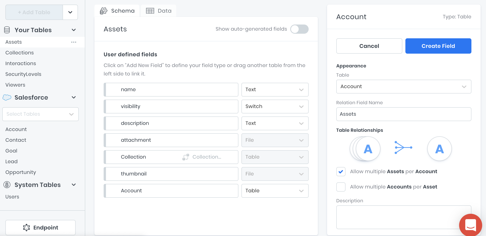
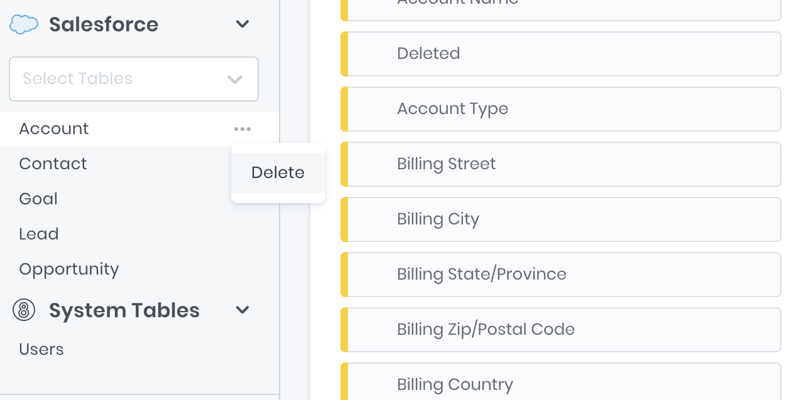

# Salesforce

The Bolt + Salesforce integration unifies all of your Salesforce data inside of 8base and expose it through our GraphQL API for use in custom application development.

## Set up

In the `Integrations` sections of the Console, click the "+" button. You'll see the Salesforce integration listed in the options modal; select it.

Up to 5 Salesforce integrations can be added to a single workspace. Each integration can be given a _Display Name_ and _API Name_, either of which can be changed at any time.

After the integration is created (by clicking "Create Integration"), you are able to connect your Salesforce account. If you wish to connect to a Salesforce _Sandbox_ account, as opposed to a production instance, simply select "Connect to Sandbox" from the "Connect" button's dropdown menu.



Whichever Salesforce account you choose to connect to, clicking "Connect" will direct you to a Salesforce sign-in page. Once authenticated, you will be re-directed back to 8base and the system will begin syncing your Salesforce schema within the workspace.

## Adding Tables

Once the schema has been synced, you will be able to add any Salesforce tables to your workspace using the [Data Viewer](https://docs.8base.com/docs/8base-console/plugins-integrations/salesforce). By default, the _Account_, _Lead_, _Contact_, and _Opportunity_ tables will appear in the newly added Salesforce section of the Data Builder.

In the "Select Tables" search input, any table that exists in your Saleforce instance is discoverable. To add any available tables, simply select it from the list and the import will begin.



## Adding Relations

Relationships between 8base and Salesforce tables can easily be established. For example, this may be helpful when building an application where a table called _Orders_ exists in the 8base workspace database, while customer _Accounts_ are maintained in Salesforce.

By dragging and dropping a table's name over the "Add New Field" input, the relationship declaration will populate. All required changes can then be made before saving the relationship.



## Removing Tables

Any table can be quickly removed from the Data Builder without disconnecting the integration. Simply select the "Delete" option from the table options menu and confirm the name.

Deleting a Salesforce table may result in data loss when records have a mandatory relationship with records in the table being deleted.



## Using the GraphQL API

Just like with all other tables in an 8base workspace, all GraphQL operations required for managing the Salesforce tables/records are auto-generated (queries, mutations, and subscriptions).

Whether you only need data from Salesforce, an 8base record with related data in Salesforce, or both Salesforce and 8base table data independently, the GraphQL API is ready for you to use.

Additionally, know that 8base is **not** importing your Salesforce data to the workspace. All data that is stored in your Salesforce instance still resides there and is only read be 8base.

## Examples

### Query Salesforce Data

Query a list of all Salesforce accounts created since the January 1st, 2020.

```graphql
query {
  salesforce {
    accountsList(filter: { CreatedDate: { gt: "2020-01-01T00:00:00.000Z" } }) {
      items {
        Name
        Type
        BillingStreet
        BillingCity
      }
    }
  }
}
```

### Create 8base/Salesforce Records

Create an 8base table record, with the related Salesforce record in one GraphQL call.

```graphql
mutation {
  assetCreate(
    data: {
      name: "New 8base Asset"
      description: "Description of the asset"
      account: { create: { Name: "New Salesforce Account" } }
    }
  ) {
    id
    name
  }
}
```
