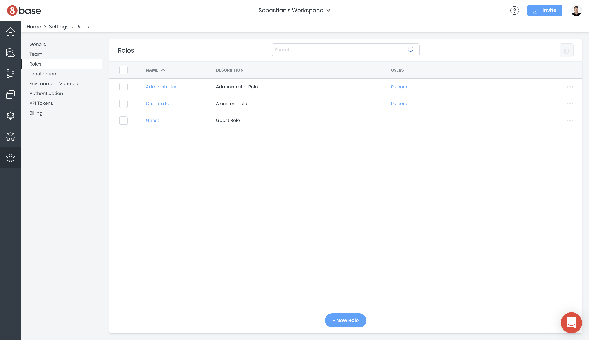
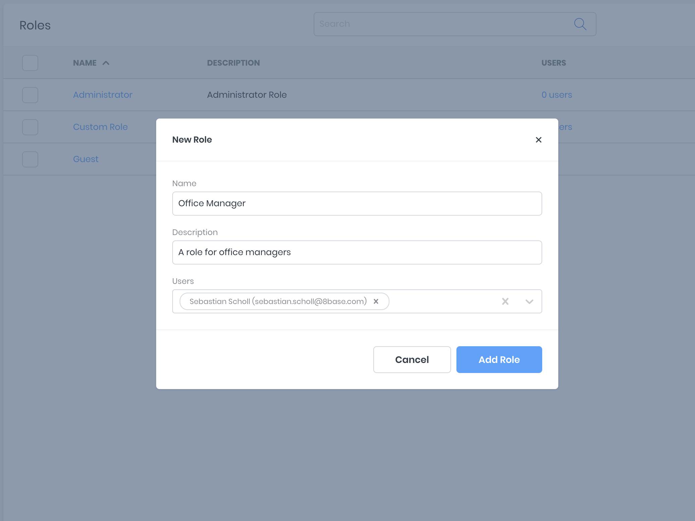
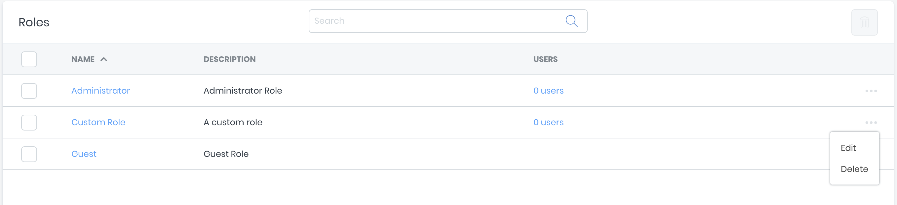
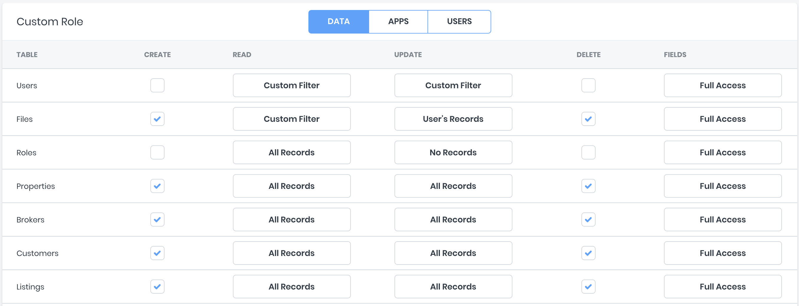
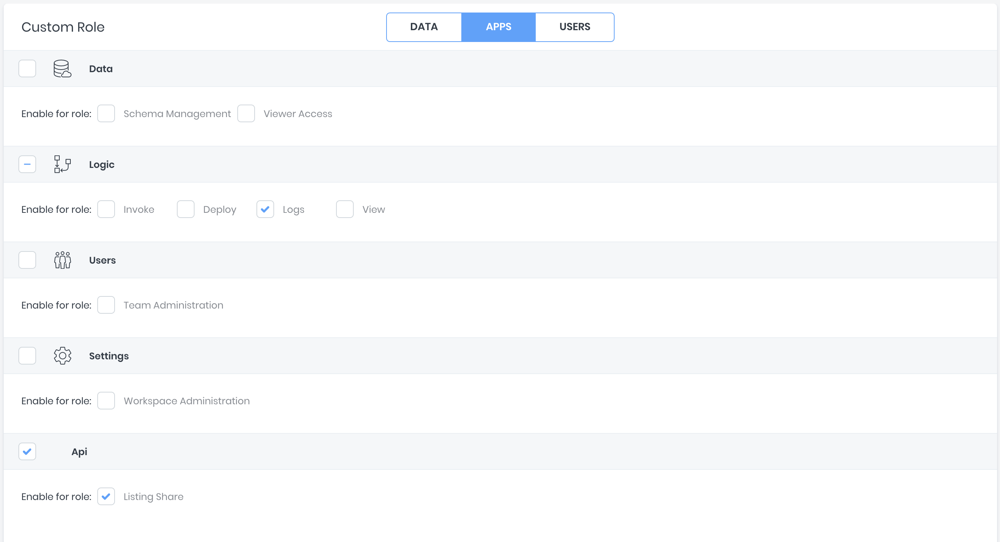
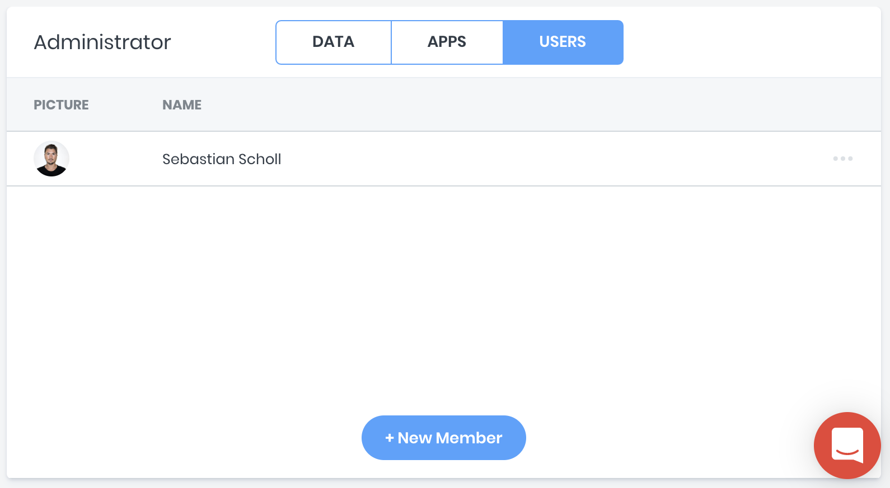
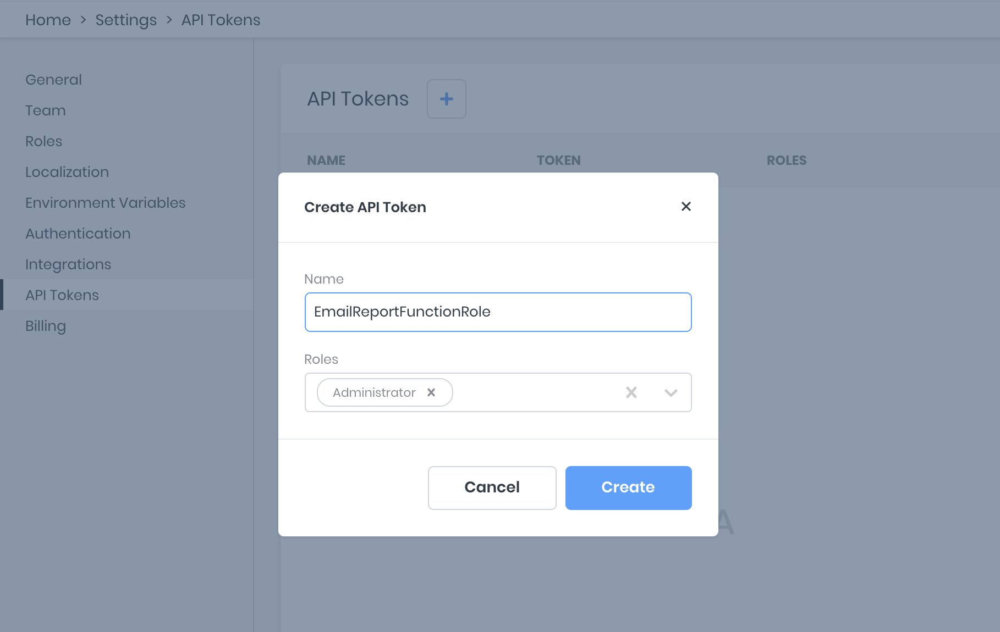
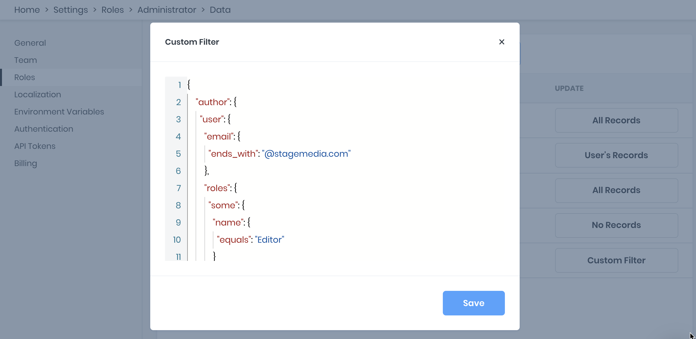

# Authorization

Authorization in 8base uses a robust roles and permissions system that lets you securely control access to any data resources in a workspace. You use the roles and authorization system to control what users (with roles) are able to access and who is authorized (has permission) to do what.

## Managing Roles

*Roles* in 8base are best described as a single identifier for a collection of *permissions*. A user can have one or more *roles* associated with their account, each of which may allow them to perform zero or more actions.

### View all Roles

The *Roles* Manager can be found in a given workspace by navigating to `App Services > Roles`. In this view, you can find all 8base and customer defined roles associated with the current workspace. By default, all workspaces are created with two default roles; *Administrator* and *Guest*.

* **Administrator** has all permissions enabled by default
* **Guest** has no permissions enabled by default

*Note: all roles are fully editable.*



### Create new Role

Creating a new custom Role is simple. In the Roles Manager view (`App Services > Roles`), click the `+ New Role` button at the bottom of the screen. Add a unique name (required) and a simple description before clicking `Add Role`. You may optionally assign users to the new role in the create form. However, this may also be done at anytime in the future once permissions have been specified.



### Deleting a Role

To delete a role, toggle the ellipsis toggle located at the end of the roles table row. Click the `Delete` option and then confirm your action through the modal.



## Managing Permissions

**Permissions** in 8base refer to the specific actions a user is authorized to take. These permissions are defined under a *Role*, which is then attributed to a user. For example, a permission that authorizes a user to read *Posts* may be defined under the *Guest* role.

In the Roles Manager view (`App Services > Roles`), click on the name of a *Role* whose permissions you'd like to update. You'll be taken to a view containing three tabs; *Data*, *Apps* and *Roles*.

### Data
Lists all data tables in the current workspace. Each table exposes the ability to set Create, Read, Update, Delete (CRUD) and Field permissions using simple controls. If fine-tuned permissions beyond CRUD actions are required, `Custom Filters` on tables and `Custom Access` on fields can be implemented.



### Apps
Allows toggling of role permissions for 8base Management Console administration, such as Schema Management, Workspace Settings, Team Administration and more.



### Users
Lists all users that hold the selected role and allows for easy role assignment and de-assignment to specific users.

*Note: By default, all users are granted the **Guest** role. You may change the name of the Guest role in the edit form.*



## API Tokens
While roles can be assigned to users, they can also be assigned to API Tokens. Unlike an `idToken` that is recieved when a user authenticates and authorizes requests made to the API, API Tokens are static and often used to authorize server-to-server or app-to-server requests. Simply put, API Tokens authorize requests made to the API **without any user context**.

API Tokens can be created in [`Settings > API Tokens`](https://app.8base.com/settings/api-tokens). Note that you can only copy the token on create! So make sure to copy the value and store it securely. The roles associated with the token will enforce which permissions the token has. API Tokens by default have not permissions.



## Advanced
Custom filters are applied to the *Read* and *Update* permissions of any role, making advanced scoping of the records possible. These filters get constructed using `JSON` and mirror table specific GraphQL filter types.

### Default Filters
To better understand custom filters, lets reference two default filters that come configured in new workspaces.

* **Table**: Users  
* **Permission**: Read and Update

New roles, by default, don't allow the logged in user to read or update other user records. To enforce this, a custom filter is applied to role's read and update permission in regards to the *Users* table. 

```json
{
  "id": {
    "equals": "__loggedInUserId"
  }
}
```

In this example, `__loggedInUserId` is a dynamic variable that 8base replaces with the logged in user's ID. If the ID of the logged in user does not match the ID of a given user record, it cannot be read or updated.

* **Table**: Files  
* **Permission**: Read and Update

8base stores media (videos, documents, images, etc...) as records in a system table called *Files*. This makes it necessary for media to be scoped, by default, to the following constraints:

1. When a file is public, anyone can view it.
2. When a file is private, only the user it was created by can view it.

These constraints get enforced using the following filter.

```json
{
  "OR": [
    {
      "public": {
        "equals": true
      }
    },
    {
      "createdBy": {
        "id": {
          "equals": "__loggedInUserId"
        }
      }
    }
  ]
}
```

### Dynamic Variables

There are 3 dynamic variables that can be used when creating Roles. They are:

• `__requestingApiToken` - The API Token being used to authenticate the request.

• `__loggedInUserEmail` - The authenticated user's email address.

• `__loggedInUserId` - The authenticated user's ID.


### Custom Filters
<YoutubePlayer src="https://www.youtube.com/embed/FqZ0-usc93w"/>

The best way to write custom filters is by using the API Explorer in conjuction with [Variables](/docs/8base-console/graphql-api/variables/). The filtered result of any GraphQL query is the scoped record set that can be expected by using the same filter as a role's *Custom Filter*.

For example, imagine that a workspace has both *Posts* and *Authors* tables. In the API Explorer, an 8base user wants to query all *Posts* that belong to *Authors* under the following criteria:

1. Only authors who work for Stage Media (have *@stagemedia.com* email handles) 
2. Only authors who have been attributed a *Role* named "Editor".

GraphQL Query
```js
/* GraphQL Query */
query($filter: PostFilter) {
  postsList(filter: $filter) {
    items {
      id
      title
    }
  }
}
```

Query Variable
```json
{
	"filter": {
    "author": {
      "user": {
        "email": {
          "ends_with": "@stagemedia.com"
        },
        "roles": {
          "some": {
            "name": {
              "equals": "Editor"
            }
          }
        }
      }
    } 
  }
}
```

After successfully running this query, the user decides that the filter should be utilized as a custom filter for post updates. That way, only *editors* would only be able to update posts that belong to authors from their own company. 

To accomplish this, the value of the `filter` key can be pasted into the *Custom Filter* section of the desired role's update permission.



