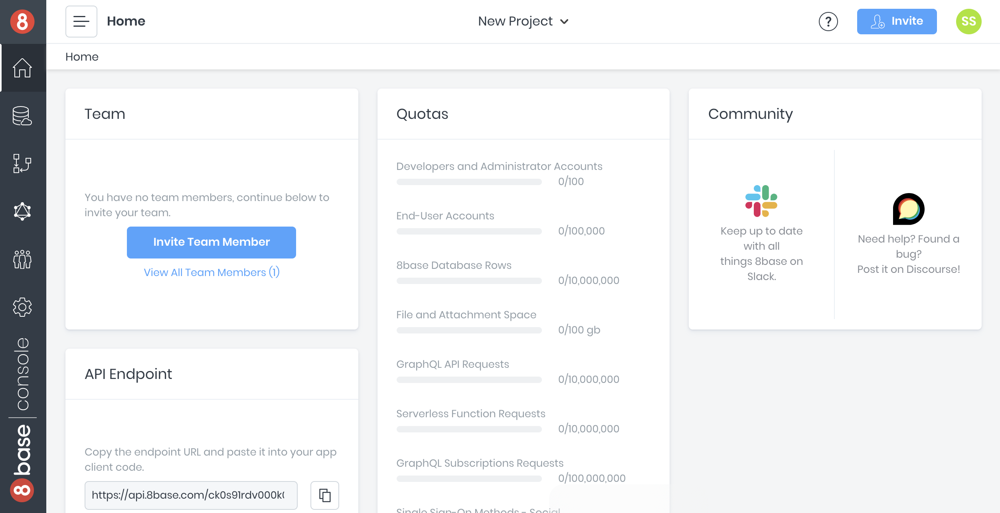
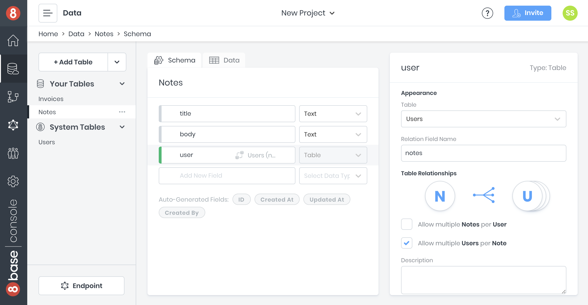
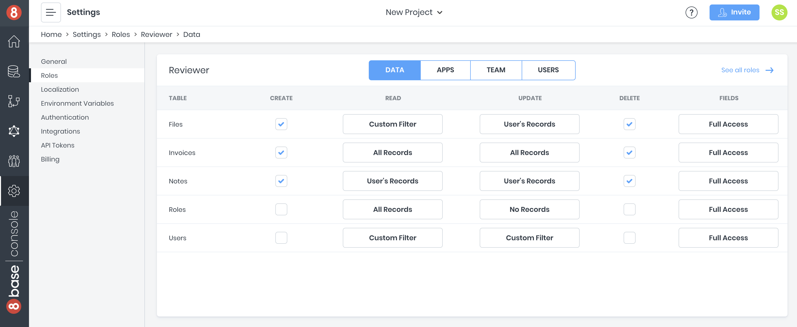
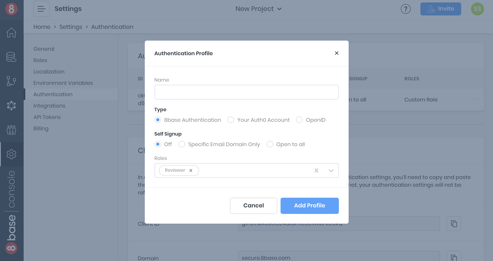
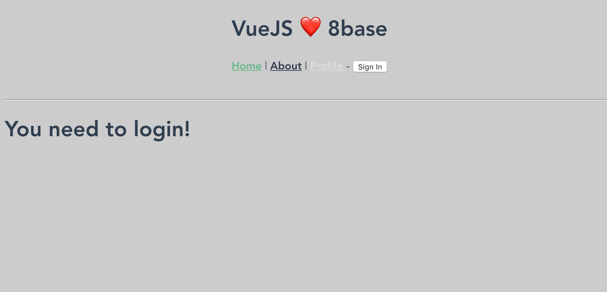

# Quick Start
The goal of this quickstart is to get you up and running with 8base and a front-end framework you love, fast. Let's do it!

This guide will introduce some basics of 8base workspaces and set up a starter app. It will help demonstrate key concepts of 8base, and maybe even kick-off your next awesome project 😊

## 1. Start an 8base Account
If you haven't already, create an 8base account. Click [this link](https://app.8base.com) to get started. We'll send you a confirmation email if you use an email and password to create your account. Either way, once your account is confirmed 8base will redirect you to a default workspace.

Voila! You've officially on 8base.

## 2. Setting up a Workspace
Each workspace is treated as an individual project – like having different Git repositories for different code bases. This makes it easy to stay organized with projects and upgrade individual workspaces when your app or service starts to scale! 

Each workspace starts on a [30-day Free Trial](https://www.8base.com/pricing). Let's just use the default workspace for the rest of this quick-start.



_Optional: If you want to create a new workspace, click the "YOUR NAME's Workspace" dropdown at the top of your screen and select "+ New Workspace". Name it whatever you like before pressing create. The new workspace should load in less then 10-seconds._

### 2.1. Building a Data Model
In the workspace, navigate to the [Data Builder](https://app.8base.com/data/) page and click on `[+ Create Table]`. We're going to create one simple table and name it *Notes* for our data model with the following fields.

**Notes**

| Field | Type | Description | Options |
| ----- | ---- | ----------- | ------- |
| `title`  | Text | The notes title | `mandatory=True` |
| `body`  | Text | The notes body | `mandatory=True` |

Once the tables is created, we're going to establish a relationship between it and the *Users* table - the *Users* table has already been created for you, by default. This can be done by dragging one table onto the other. However, we'll build the one-to-many relationship manually on the *Notes* table.

**Add user to Notes**

| Field | Type | Description | Options |
| ----- | ---- | ----------- | ------- |
| `user` | Table | A notes other | `table=Users`<br>`Relation Field Name=notes`<br>`Allow multiple Notes per User=True`<br>`Allow multiple Users per Note=False` |



Before moving on, lets also add several dummy records to our database. You can do this manually by navigating to the `data` tab. However, lets just run the following GraphQL mutation in the [API Explorer](https://app.8base.com/api-explorer). Make sure to swap `<YOUR_ACCOUNT_EMAIL_ADDRESS>` with your email address!

```javascript
mutation {
  userUpdate(
  filter: {
    email: "<YOUR_ACCOUNT_EMAIL_ADDRESS>"
  },
  data: {
    notes: {
      create: [
        {
          title: "New favorite food",
          body: "My new favorite food is the impossible burger"
        },
        {
          title: "This weeks todos",
          body: "Buy milk, cookies, and walk the dog."
        }
      ]
    }
  }) {
    notes {
      count
    }
  }
}
```

GraphQL mutations (like the one above) handle record creates, updates, and deletes. The `data.notes.create` value will actually create notes associated with the user record we're identifying by email – which is **you** in this example. The reason the value is an array is because *Users* can have many *Notes*. 

This is a great example of how 8base supports relational queries and mutations!

- *[GraphQL API docs](https://docs.8base.com/8base-console/graphql-api)*
- *[API Explorer docs](https://docs.8base.com/8base-console/platform-tools/api-explorer)*

### 2.2. Roles and Permissions
We only want to users to see their own notes. A custom role can enforce this. Navigate to `Settings` > `Roles` and create new role with the name "Reviewer". Once created, click the role and let's update its permissions. 

Let's check the appropriate boxes and select the needed options.

**Reviewer**

| Table | Create | Read | Update | Delete | Fields |
| ----- | ------ | ---- | ------ | ------ | ------ |
| Notes | True | User's Records | User's Records | True | Full Access |

Now, all users with the *Reviewer* role who call the workspace API endpoint have these permissions when querying notes. 8base handles roles and permissions natively so that it's easy to control what actions users can take on data resources. 



- *[Roles and Permissions docs](https://docs.8base.com/8base-console/roles-and-permissions)*

### 2.3. Authentication Profiles
Setting up authentication will allow users to sign-up, log-in, and log-out of the app. For this quickstart, users should be authenticated to view their list of notes.

Navigate to the [Authentication page](https://app.8base.com/settings/authentication) in settings. To create a new authentication profile, click the plus-sign button and specify the following values. 

| Option | Value | Notes |
| ------ | ----- | ----- |
| `Name` | "Default Guest Auth" | Choose any descriptive name |
| `Type` | 8base authentication | Find more auth info in the [docs](https://docs.8base.com/8base-console/authentication#8base-authentication) |
| `Self Signup` | Open to all | Leave `Off` if using a free workspace |
| `Roles` | Reviewer | Multiple roles can be assigned to user on sign up |

Add the new authentication profile. The information that’s now displayed will be used when adding authentication to the frontend. Note the Authentication Profile `Id`, the `Client ID` and the `Domain` – these values will come in handy later in the article.



Scroll down to where you see `Custom Domains`. This is where you can provide routes that’ll be used during authentication. Make sure the `localhost:port` number matches that which your app will run on in development - or other redirect URLs for native apps!

- *[Authentication Profile docs](https://docs.8base.com/8base-console/authentication#8base-authentication)*

### 2.4. Getting the Workspace API Endpoint
Lastly, let’s copy our workspace’s API endpoint. This endpoint is unique to our workspace and is to where we will send our data requests using GraphQL. It's schema is a follows:

```shell
https://api.8base.com/<WORKSPACE_ID>
```

There are a few ways to obtain the endpoint. However, just navigate to the workspace **Home** page and you’ll find the endpoint in the bottom left. 

## 3. Setting up the Client
An important concept to grasp is that 8base is a Backend-as-a-Service that **any** frontend application can connect to using the workspace API. This creates a very clear separation between the server-side (8base) and client-side (an app / frontend). 

```
# Project Directory Tree

8base-starter-app
├── README.md
├── client/
└── server/
```

Lets create a new directory with this separation in mind by creating the above `Project Directory Tree` structure. This can be accomplished with the following two shell commands.

```
# Make directory with client/ and server/ directory at root
mkdir 8base-starter-app 8base-starter-app/client 8base-starter-app/server

# Move into project and add README.md
cd 8base-starter-app && touch README.md
```
### 3.1. Install the 8base CLI and Authenticate
To harness the full power of 8base, you'll want to have [Node.js](https://nodejs.org/) installed on your computer. Without it, you won't be able to install our handy [8base CLI](https://github.com/8base/cli).

Assuming you're all set up and able to use `npm`, let's go ahead and install the 8base CLI.

```text
# Install 8base globally
npm install -g 8base-cli
```

When using the 8base CLI you need to authenticate your development workspace. This allows you to communicate with 8base for deploys, function invocations, logs, and more. Try running the `login` command and allow your browser to launch a new window; you'll need to login.

```text
# Login with CLI.
8base login
```

### 3.2 Deploy a Serverless Function (**OPTIONAL**)
This step is **totally optional** in the quickstart. It will show you how to quickly extend your workspace by generating and deploying serverless functions to a workspace. 

Move into the `8base-starter-app/server` directory. Let's initialize a new server project and configure it to a hosted workspace. Using the `init` and `configure` commands will generate and configure the needed resources. The workspace you select is the one where the Custom Functions will be deployed to when ready.

```text
# Change into the server directory
cd ../server

# Init new 8base project with one function called myCustomResolver
8base init . --functions=resolver:myCustomResolver

# Install dependencies
npm install

# Configure the project's workspace
8base configure

✔ Select workspace for current project › Default Workspace
```

Once configured, a `.workspace.json` file gets added to the directory which conatains the selected workspace's ID. Feel free to poke around the files marked with an astrix(*) below before deploying the dummy function.

```sh
server
├── .workspace.json
├── *8base.yml
├── package.json
└── src
    └── resolvers
        └── myCustomResolver
            ├── *handler.ts
            ├── mocks
            │   └── *request.json
            └── *schema.graphql
```

By running the `8base deploy` command, we deploy the Function to our workspace (AWS Lambda in the background). Being a `resolver` function, we've now added the `myCustomResolver` operation to our GraphQL API. Pretty cool! Test it out using the CLI or in the API Explorer.

```
# Invoke function in production
8base invoke myCustomResolver -m request

# Invoke function locally
8base invoke-local myCustomResolver -m request
```

There are many custom function types you can deploy on 8base, all of which must be configured in the `8base.yml` file located at the root of your project.

<!---->
Serverless custom functions provide tremendous flexibility in customizing server-side resources and allowing advanced capabilities, like: 

* Resolvers: For adding custom *Querys* and *Mutations* to the GraphQL API.
* Triggers: For invoking functions on data events (before|after record create|update|delete, run function)
* Webhooks: For invoking functions on webhook events using HTTP requests ([GET|POST|PUT|DELETE] @ endpoint)
* Scheduled Tasks: For invoking functions on timed intervals (once a day, every five-minutes, or cron format)
<!---->

- *[Custom Functions docs](https://docs.8base.com/8base-console/custom-functions)*

### 3.3. Choose a Starter App / Framework for the Frontend
8base gives you full freedom to use whatever front-end technologies/frameworks you love. For this quickstart, we recommend that you use one of our starter apps. Currently, they are:

| Framework | Repo | Clone |
| ------    | -----   | ------- |
| Vue | [Repo](https://github.com/8base/vue-8base-starter-app) | `git clone https://github.com/8base/vue-8base-starter-app.git`|
| React | [Repo](https://github.com/8base/react-8base-starter-app) | `git clone https://github.com/8base/react-8base-starter-app.git` |

Depending on the framework you wish to use, try cloning it into the `8base-starter-app/client` directory.

```
# Move into the client directory and
cd ../client

# Clone Starter App
git clone <CloneUrl> .

# Install dependencies
npm install
```

### 3.4. Setting up the client
All of the 8base starter apps are preconfigured for both authentication and API communication. They only need a few environment variables to get. Those environment variables are:

```shell
APP_WORKSPACE_ENDPOINT=<workspace_endpoint>
APP_AUTH_PROFILE_ID=<auth_profile_id>
APP_AUTH_CLIENT_ID=<auth_client_id>
APP_AUTH_DOMAIN=<auth_domain>
```

Look for a `8base-starter-app/client/.env` file that contains a template for the required environment variables. Fill in the template with all appropriate values. Each starter app will have a thorough READme.md with instructions on which files are responsible for which functionality. Please read them!

## 4. Run the app!
Using the command that's appropriate to the chosen starter app (`npm start/serve/etc.`), boot it up! You'll find the right start command in the starter app's READme.md file.



You can now login, logout, and sign-up in the starter app using your username and password. Meanwhile, when authenticated you're able to access the Profile page, which queries the GraphQL API for the authenticated user information. 

Authenticated queries happen by passing an `idToken` as a Authorization header on API calls. This `idToken` is recieved and stored when the user authenticates. The auth flow differs slightly depending on the starter app you chose. However, each fully documents it's own authentication flow and state management strategy. 

## 5. Challenge
Who ever said life has to be easy? No one! The whole goal of this quickstart is to learn, and you can't learn if you don't try! So, here is a challenge for you.

Go back to the [API Explorer](https://app.8base.com/api-explorer) and click on the `Explorer` button. Once opened, find the `notesList` operation and build a query. Once that query is built, run it to make sure it's working properly. 

It could look something like this:

```javascript
query {
  notesList(first: 10, filter: {
    title: {
      contains: "food"
    }
  }) {
    count
    items {
      title
      body
      user {
        email
      }
    }
  }
}
```

Now, try to copy the working query and add it to your application. Look for a `graphql.js` file if you're working with a JavaScript application, or simply add it anywhere you see fit. Go ahead! 

Using this query, you'll start getting your notes data back from the API. With that data, you can build an awesome notes component inside your application. 

Take the time to investigate the starter app for clues on how you might execute that query. However, if you need some help making it happen, here's a simple script that will help give you an idea.

```javascript
/* A GraphQL library is required */
const { GraphQLClient } = require('graphql-request');

/* Create a GraphQL client instance to send requests */
const client = new GraphQLClient(endpoint, { 
  headers: {
    Authorization: `Bearer <ID_TOKEN OR API_TOKEN>`
  } 
});

/* Execute an API request */
const data = await client.request('<YOUR_API_ENDPOINT>', `
  query {
    notesList(first: 10
    }) {
      items {
        title
      }
    }
  }
`);

/* Do something with the data! */
console.log(data);
```

- *[Connecting to the API docs](https://docs.8base.com/getting-started/connecting-to-api)*

## Conclusion
We hope this quickstart guide has helped you better understand how 8base works! We know that there was a lot in it. Feel free to keep experimenting with your workspace, add new tables, deploy custom logic, and develop some amazing applications!

If you need help or have questions, definately check out the [8base Community Here](https://community.8base.com)! Also, [our documentation](https://docs.8base.com) has a ton more information on everything that we've covered here. 

Happy coding!
