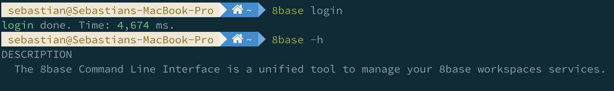
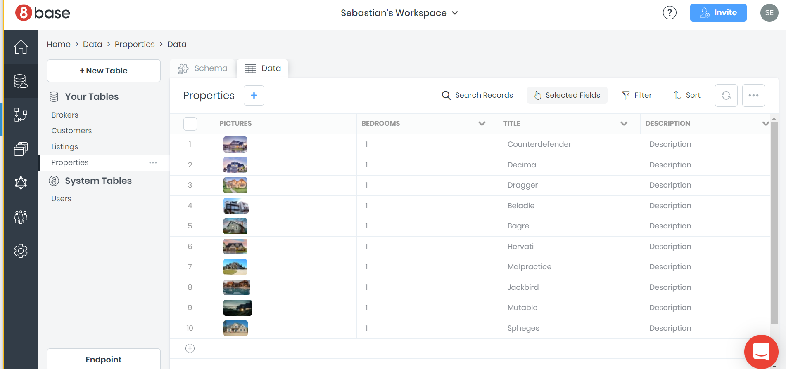

# Quick Start
An easy way to get familiar with 8base is to go through the steps to download, install, and run a one of the starter apps. To make this process easy, we've created a quickstart guide for you! It will help demonstrate some important concepts of 8base, and maybe even kick-off an awesome project😊

So... let's get to it!

## 1. Create an 8base Account
The first thing you'll need to do – if you haven't already – is create an 8base account. To get started, click [this link](https://app.8base.com). If you use an email and password to create your account, we'll send you a confirmation email. Either way, once your account is confirmed 8base will redirect you to your default workspace.


Voila! You've officially signed up for 8base.

## 2. Visit your Workspace
In 8base, each workspace is treated as an individual project – much like you probably have different Git repositories for different code bases. This allows you to easily stay organized with projects, as well as upgrade individual workspaces when your app or service starts to scale! Each workspace starts on a [30-day Free Trial](https://www.8base.com/pricing).

Let's just use the default workspace for the rest of this quick-start.

_Optional: If you want to create a new workspace, click the "YOUR NAME's Workspace" dropdown at the top of your screen and select "+ New Workspace". Name it whatever you like before pressing create. The new workspace should load in less then 10-seconds._


## 3. Install the 8base CLI and Authenticate
Open up your Terminal of choice. To harness the full power of 8base, you'll need to have [Node.js](https://nodejs.org/) installed on your computer. Without it, you won't be able to install our handy [8base CLI](https://github.com/8base/cli).

Assuming you're all set up and able to use `npm`, let's go ahead and install the 8base CLI.

```text
# Install 8base globally
npm install -g 8base-cli
```

When using the 8base CLI you need to authenticate your development workspace. This allows you to communicate with 8base for deploys, function invocations, logs, and more. Try running the `login` command and allow your browser to launch a new window \(you may have to login\).

```text
# Login with CLI.
8base login
```



## 4. Setting up the Local Project
An important concept to grasp is that 8base is a Backend-as-a-Service that any frontend application can connect to using the API. This creates a very clear separation between the server-side (8base) and client-side (app/interface). 

```
# Directory Tree

8base-starter-app
├── README.md
├── client/
└── server/
```

Lets create our new project with this separation in mind by adding a new directory with the printed `Directory Tree` structure. This can be accomplished with the following two commands.

```
# Make directory with client/ and server/ directory at root
mkdir 8base-starter-app 8base-starter-app/client 8base-starter-app/server

# Move into project and add README.md
cd 8base-starter-app && touch README.md
```
## 5. Set up Client
8base gives you full freedom to use whatever front-end technologies/frameworks you'd like! For this quickstart, we recommend that you use one of our starter apps. Currently, they are:

1) **Vue** Starter App - [https://github.com/8base/vue-8base-starter-app.git](https://github.com/8base/vue-8base-starter-app)
2) **React** Starter App - [https://github.com/8base/react-8base-starter-app.git](https://github.com/8base/react-8base-starter-app)

Depending on the framework you wish to use, try cloning it into the `client/` directory that we just created. The following commands have been listed for each framework.

```
# For Vue
git clone https://github.com/8base/vue-8base-starter-app.git client

# For React
git clone https://github.com/8base/react-8base-starter-app.git client
```

After cloning the project, make sure to change into the `client` directory and run `npm install` (or `yarn`) so that all the required packages get installed.

## 6. Setting up the Workspace
We're now going to hop over to the [8base Management Console](https://app.8base.com) and provision the workspace with a few key resources.

##### Building a Data Model
In the workspace, navigate to the [Data Builder](https://app.8base.com/data/) page and click on “+Add Table” to start building a data model. Were going to create one simple tables with the following fields.

**Posts**
| Field | Type | Description | Options |
| ----- | ---- | ----------- | ------- |
| `title`  | Text | The notes title | `mandatory=True` |
| `body`  | Text | The notes body | `mandatory=True` |

Once the tables is created, we're going to establish a relationship between it and the *Users* table. This can be done by dragging one table onto the other. However, let's build the one-to-many relationship manually on the *Posts* table.

**Posts**
| Field | Type | Description | Options |
| ----- | ---- | ----------- | ------- |
| `title`  | Text | The notes title | `mandatory=True` |
| `body`  | Text | The notes body | `mandatory=True` |
| `author` | Table | A notes other | `table=Users`<br>`Relation Field Name=posts`<br>`Allow multiple Posts per User=True`<br>`Allow multiple Users per Post=False` |

Before movin on, lets also add some dummy records to our database. This can be done manually by clicking on a table and navigating to the `data` tab. This time around, lets just run the following GraphQL mutation in the [API Explorer](https://app.8base.com/api-explorer).

```javascript
mutation {
  userUpdate(
  filter: {
    email: "sebastian.scholl@8base.com"
  },
  data: {
    notes: {
      create: [
        {
          title: "New favorite food",
          body: "My new favorite food is the impossible burger"
        },
        {
          title: "This weeks todos",
          body: "Buy milk, cookies, and walk the dog."
          completed: false
        }
      ]
    }
  }) {
    notes {
      count
    }
  }
}
```
GraphQL mutations handle record creates, updates, and deletes. Using aliases (the keys named'steve', 'bonnie', etc.), we're able to run multiple operations in a single request. The `data.mealTickets.create` value will actually create an associated meal ticket record after the attendee record is created. That value is currently an array since attendees can have many tickets. Lastly, a `fragment` is simply a templates for our queries. Its contents could be written out in the query response plainly.
##### 3) Roles and Permissions
To allow app users to securely access the API with appropriate permissions, were going to create a custom role. Navigate to `Settings` > `Roles` and create new role with the name "Meal Ticketer". Once created, click the role and lets update its permissions. 
Here we can update the Meal Ticketer's (a person using the app) permissions. For example, they should be able to do things like create `attendees` or `mealTickets`, and update `mealTickets` but not delete them. Let check the appropriate boxes and select the needed options.
**Meal Ticketer**
| Table | Create | Read | Update | Delete | Fields |
| ----- | ------ | ---- | ------ | ------ | ------ |
| Attendees | True | All Records | All Records | False | *Defaults |
| MealTickets | True | All Records | All Records | False | *Defaults |
Now, all unauthenticated users who call the workspace API endpoint and have the `Meal Ticketer` role can permform these actions.
##### 4) Authentication Profile
Setting up authentication will allow users to sign-up, log-in, and log-out of the app. Users should be authenticated to view the list of attendees and to perform tasks like allocating and invalidating tickets. We’ll configure 8base to handle authentication.
Navigate to the [**Authentication**](https://app.8base.com/settings/authentication) page to begin the setup. We’ll need to create an authentication profile that contains roles, allowed urls, etc. 
To create a new authentication profile, click the button with a plus-sign button and specify the following values:
| Option | Value | Notes |
| ------ | ----- | ----- |
| `Name` | "Default Guest Auth" | Choose any descriptive name |
| `Type` | 8base authentication | Find more auth info in the [docs](https://docs.8base.com/8base-console/authentication#8base-authentication) |
| `Self Signup` | Open to all | Leave `Off` if using a free workspace |
| `Roles` | Meal Ticketer | Multiple roles can be assigned to user on sign up  |

Add the new authentication profile. The information that’s now displayed is useful when connecting the client application to the authentication profile. Note the Authentication Profile `Id`, the `Client ID` and the `Domain`; these values will come in handy later in the article.
Next, we’ll set the custom domains. Scroll down to where you see `Custom Domains`. This is where you can provide routes that’ll be used during authentication. Update your URLs to be similar to the screenshot below. 
*Note: make sure the `localhost:port` number matches that which your React app will run on!*

##### 5) Getting the Workspace API Endpoint
Lastly, let’s copy our workspace’s API endpoint. This endpoint is unique to our workspace, and is where we will send our GraphQL queries URL. 
There are a few ways to obtain the endpoint. However, just navigate to the workspace **Home** page and you’ll find the endpoint in the bottom left. 
   

Developers are able to extend their 8base workspace's using custom serverless functions. This provides tremendous flexibility in customizing an application, allowing advanced capabilities, like: 

* Resolvers: For adding custom *Querys* and *Mutations* to the GraphQL API.
* Triggers: For invoking functions on data events (before|after record create|update|delete, run function)
* Webhooks: For invoking functions on webhook events using HTTP requests ([GET|POST|PUT|DELETE] @ endpoint)
* Scheduled Tasks: For invoking functions on timed intervals (once a day, every five-minutes, or cron format)

Custom functions are entirely optional in any project. However, lets give them a try and learn some cool CLI tricks in the process. 

Move into the `server/` directory and "link" the local project with a hosted workspace. Using the `configure` command will allow us to create/select the workspace. The workspace you select is the one where the Custom Functions will be deployed to when ready.

```text
# Change into the server directory
cd ../server

# Install dependencies
npm install

# Configure the project's workspace
8base configure

✔ Select workspace for current project › Default Workspace
```

Once configured, a `.workspace.json` file gets added to the current directory which conatins the selected workspace ID.



## 6. Fire-up the App
Let's get this show on the road. To start up the app let's first change back into the `client` directory.

### For Mac Users

```text
# Change to client directory
cd ../client

# Install dependencies
npm install

# Swap placeholder with API URL and run start command
REACT_APP_8BASE_API_ENDPOINT=<YOUR_API_URL_GOES_HERE> npm start
```


### For Windows Users

If you're developing with 8base on a Windows machine, there are a few extra steps to take for everything to run smoothly.

1. In `app-example/client/package.json`, update the `react-scripts: '3.0.0'` dependency to be `react-scripts@2.1.8`
2. Install `npm install react-scripts@2.1.8` from your terminal
3. Install `npm install -g cross-env` from your terminal
4. Update `app-example/client/package.json` to only contain the following:
   * ```text
     {
      "parser": "babel-eslint",
     }
     ```
5. Run `cross-env REACT_APP_8BASE_API_ENDPOINT=<YOUR_API_URL_GOES_HERE> npm start` to start the app

## What Just Happened?

You can now login and logout of the demo app using your username and password. It's done! While you may have followed a few steps at this point, you probably haven't learned much about 8base. So, lets dive in and understand the fruits of our labor.

### 8base.yml

If the `app-example` is not already open in your favorite text editor, open it now and navigate to the `app-example/server` directory. Inside, you'll find three really important files. They are the files marked with an astrix \(\*\) in the following print-out:

```text
server/
├── node_modules/
├── src/
│   ├── mailer/
│   └── mutations/
│       └── listingShare/
│           ├── handler.js*
│           └── schema.graphql*
├── 8base.yml*
├── DEMO.json
├── package-lock.json
└── package.json
```

By running the `8base deploy` command, you deployed a custom function to the serverless cloud. There are many custom function types you can deploy on 8base, all of which must be configured in the `8base.yml` file located at the root of your project. By looking at that file now, we can see a functions declaration containing a `listingShare` object that has three important keys - _handler_, _type_, and _schema_.

```yaml
functions:
  listingShare:
    handler:
      code: src/mutations/listingShare/handler.js
    type: resolver
    schema: src/mutations/listingShare/schema.graphql
```

In this quickstart, we'll skip the different function types. Just know that your `8base.yml` file is the master config file of your serverless application. In it we must declare any path to our functions and their supporting files. In the case of this `resolver` function, we've effectively extended the GraphQL API with a new Mutation that handles the "Share Listing" feature we mentioned earlier. Take a moment to check out the `handler.js` and `schema.graphql` files in `src/mutations/listingShare`. All the magic happens there :\)

### 8base Data Viewer

Your workspace was provisioned with four custom database tables upon importing the `DEMO.json` file - each with a dozen or more rows of data. The most popular way to accomplish this from scratch is by using the [Data Viewer](https://app.8base.com/data/). Navigate there now, and you'll see how easy it is to create, update, and delete your table schemas, as well as view the data they contain by switching over to the **Data** tab.

Just for fun, lets add an _Address_ field to your **Properties** table.

1. Click on **Properties**
2. Type "Address" into the _Add New Field_ input
3. Select "Smart" from the "Select Data Type" dropdown
4. Once the field form opens up, select "Address" as the format
5. Create the field


As simple as that, your _Properties_ table can now save addresses.

What's very important to know is that 8base creates all basic, and some advanced, GraphQL _queries_, _mutations_, and _subscriptions_ auto-magically for every table you define. What does this mean? You'll never again have to write another Create, Read, Update, or Delete \(CRUD\) resource / endpoint!

Don't believe me? Check out the next section.

### API Explorer

As promised, all of your CRUD actions are right here and ready to go. Let's prove it - as well as see all the GraphQL access that your applications now have access to.

Navigate to the [8base API Explorer](https://app.8base.com/api-explorer). This is essentially your API playground, where you can quickly develop and execute powerful GraphQL commands. Copy over the following command once the API explorer is loaded.

> Always be careful! The API explorer makes use of your live production data.

```javascript
query {
  propertiesList(first: 10) {
    items {
      title
      description
      pictures {
        count
      }
    }
  }
}
```

Run the query by pressing the large _play_ button (or press Cmd/Ctrl+Enter). Your requested _Properties_ list will pop up in a blink! Only sharing with you the requested data of _title_, _description_, and _pictures\[count\]_.


There's so much more you can do in the API Explorer, with many ways to learn about GraphQL and your data, so we suggest taking some time to experiment.

## Conclusion

We hope this guide helps you better understand how 8base works. Feel free to modify the data schema in your workspace, add new tables, deploy custom logic, and develop amazing applications using 8base.
